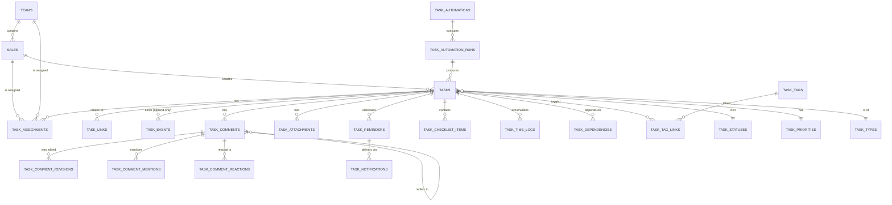
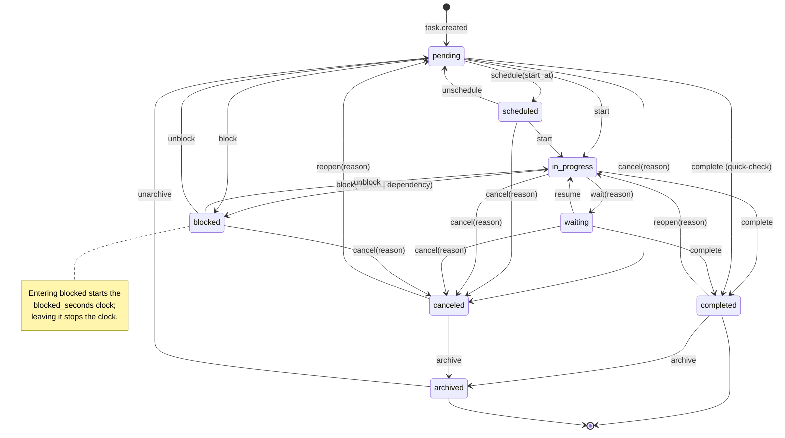
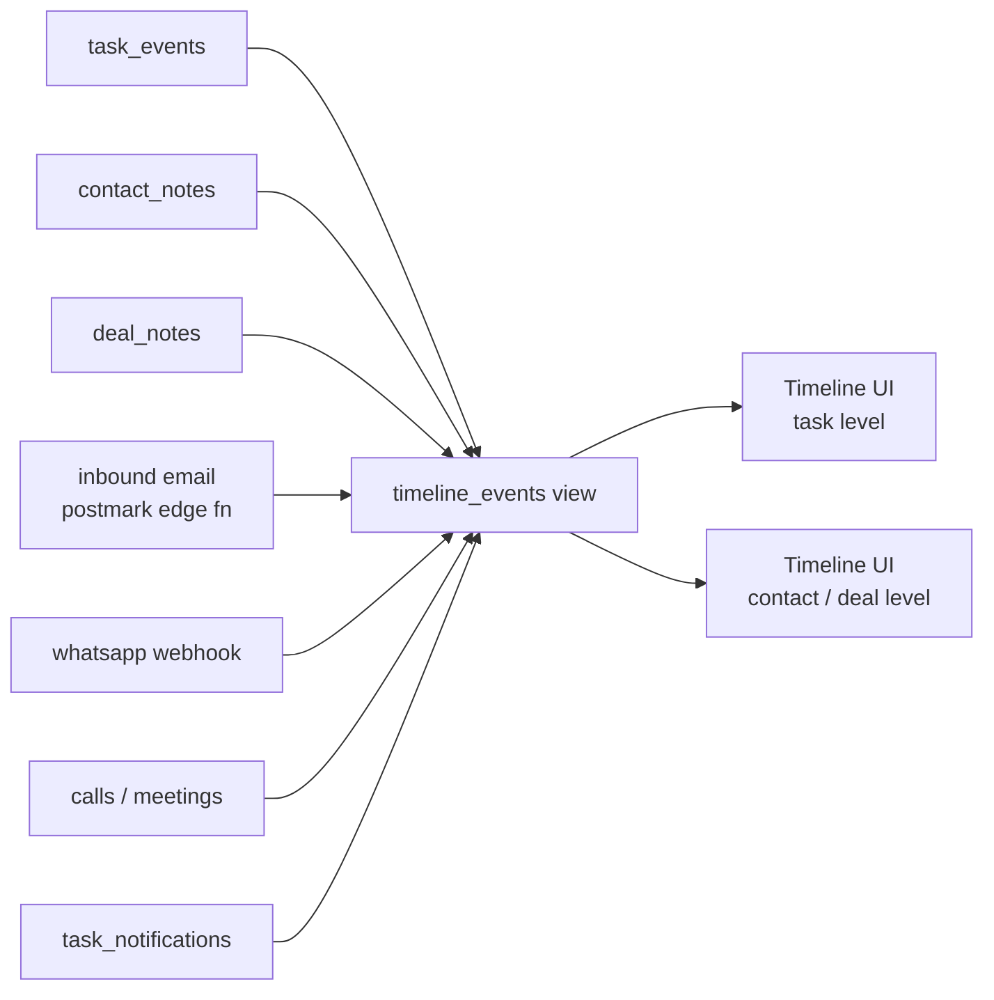
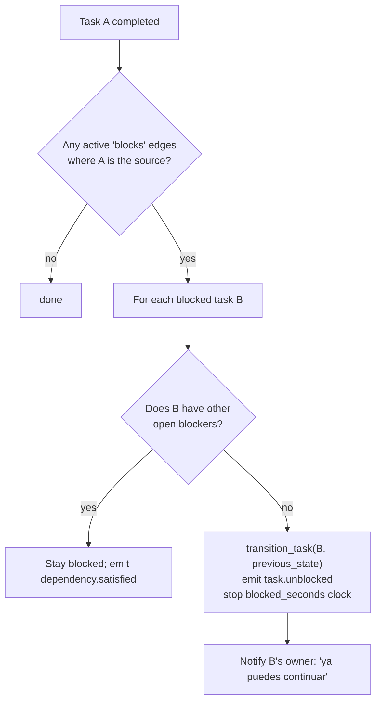
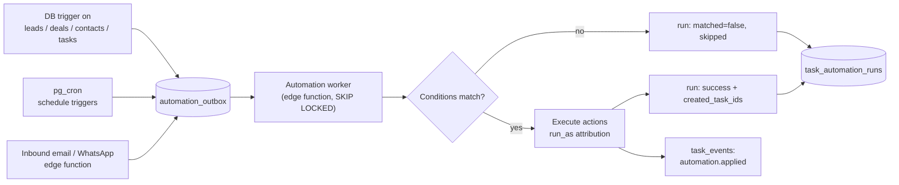

# Enterprise Task Module — Evolution Proposal

**Status:** Phase 1 and Phase 2 shipped. Phase 3 (automations, metrics,
integrations) is next — see the roadmap below
**Multi-tenancy decision (§0.1):** **single-tenant** — no `org_id`. Taken
implicitly by the Phase 1 migrations and binding on everything since.
**Author:** product + architecture review
**Scope:** the task system attached to Contacts, Leads, Companies and Deals
**Baseline:** this fork of Atomic CRM (Marmelab), including the local `sales_role` /
RLS ownership work and the Leads section
**Guiding principle:** traceability first. Every feature below exists to answer
*"who did what to this task, when, why, and what did it look like before"*. A
feature that cannot be audited is not shipped.

---

## Table of contents

0. [Context and cross-cutting decisions](#0-context-and-cross-cutting-decisions)
1. [Audit of the current system](#1-audit-of-the-current-system)
2. [Objectives of the new module](#2-objectives-of-the-new-module)
3. [Recommended data model](#3-recommended-data-model)
4. [Task lifecycle](#4-task-lifecycle)
5. [Full audit trail](#5-full-audit-trail)
6. [Timeline](#6-timeline)
7. [Assignment of responsibility](#7-assignment-of-responsibility)
8. [Comment system](#8-comment-system)
9. [Reminders](#9-reminders)
10. [Dependencies](#10-dependencies)
11. [Checklists](#11-checklists)
12. [Performance measurement](#12-performance-measurement)
13. [Automations](#13-automations)
14. [Integration with Contacts, Leads and Deals](#14-integration-with-contacts-leads-and-deals)
15. [User-facing views](#15-user-facing-views)
16. [Recommended UX](#16-recommended-ux)
17. [Security](#17-security)
18. [Scalability](#18-scalability)
19. [Comparison with other CRMs](#19-comparison-with-other-crms)
20. [Implementation roadmap](#20-implementation-roadmap)
    - [Appendix A — reuse vs. redesign](#appendix-a--reuse-vs-redesign)
    - [Appendix B — impact matrix](#appendix-b--impact-matrix)
    - [Appendix C — migration and backfill](#appendix-c--migration-and-backfill)

---

## 0. Context and cross-cutting decisions

Three decisions shape everything that follows. They are stated up front because
reversing them later is expensive.

### 0.1 Multi-tenancy: decide before writing the first migration

The current schema has **no tenant column anywhere**. Isolation is implicit: one
Supabase project = one customer. That is a valid model (it is what Marmelab
ships), but it is not a SaaS model — 500 customers means 500 projects, 500
migration runs, and no cross-tenant reporting.

| Model | Isolation | Ops cost | Cross-tenant analytics | Verdict |
|---|---|---|---|---|
| Project per tenant (today) | Strongest | O(n) deploys, n migrations | Impossible | Fine to ~20 tenants |
| Schema per tenant | Strong | Connection/catalog bloat past ~200 schemas | Painful | Avoid |
| **Shared schema + `org_id` + RLS** | Enforced by Postgres | One deploy | Native | **Recommended** |

**Recommendation:** add `org_id bigint not null` to every table, including every
new task table, and make it the **leading column of every index**. The cost of
adding it now is one column; the cost of adding it at 5k users is a rewrite of
every index, every policy and every query.

```sql
create or replace function public.current_org_id() returns bigint
    language sql stable security definer set search_path to ''
as $$
  select org_id from public.sales
  where user_id = auth.uid() and disabled = false;
$$;
```

Every RLS policy then becomes `org_id = (select public.current_org_id()) and (…)`,
mirroring the existing `(select public.can_manage_all())` idiom that the repo
already uses to force an InitPlan instead of a per-row call.

> The DDL in section 3 omits `org_id` for readability. **Add it to every table**
> if the SaaS path is taken. Section 18 assumes it is present.

### 0.2 Events are the product, not a side effect

Traceability is not "an extra table we also write to". The design below makes
`task_events` **the single append-only source of truth for history**, written by
database triggers so that *no* write path — UI, REST, edge function, psql, a
future mobile app, an automation — can bypass it. Anything that writes history
from the client is, by construction, forgeable and incomplete.

### 0.3 Backwards compatibility with the current UX

The current task UX is genuinely good at one thing: adding a follow-up to a
contact in two clicks from the contact aside. The new module must not make that
slower. Every enterprise field (priority, status, watchers, checklist) is
**optional with a sane default**, and the quick-add form keeps exactly the
fields it has today.

---

## 1. Audit of the current system

### 1.1 What exists today

The entire task feature is 7 columns and ~900 lines of React.

```sql
-- supabase/schemas/01_tables.sql
create table public.tasks (
    id bigint generated by default as identity primary key,
    contact_id bigint not null,      -- FK -> contacts, ON DELETE CASCADE
    type text,                       -- free text, no CHECK
    text text,                       -- the whole task
    due_date timestamp with time zone,
    done_date timestamp with time zone,  -- NULL = pending, NOT NULL = done
    sales_id bigint                  -- no foreign key
);
```

Frontend surface:

| File | Responsibility |
|---|---|
| `src/components/atomic-crm/tasks/AddTask.tsx` | Create dialog (contact aside + dashboard) |
| `.../tasks/TaskFormContent.tsx` | 4 inputs: text, contact, due date, type |
| `.../tasks/Task.tsx` | Row: checkbox, postpone ×2, edit, delete |
| `.../tasks/TasksListByDueDate.tsx` | Fetches up to 1000 tasks, buckets client-side |
| `.../tasks/tasksPredicate.ts` | `isOverdue` / `isDueToday` / … date predicates |
| `.../dashboard/TasksList.tsx` | "Upcoming tasks" dashboard widget |
| `.../contacts/ContactTasksList.tsx` | Tasks on the contact detail page |

### 1.2 Strengths (keep these)

1. **Two-click creation.** `AddTask` pre-fills contact, owner and due date. Most
   enterprise CRMs need 6+ fields to create a task; this is a real competitive
   advantage and must survive the redesign.
2. **Due-date bucketing is the right mental model.** Overdue / Today / Tomorrow /
   This week / Later matches how a rep actually plans a day, better than a raw
   sortable grid.
3. **The `isRecentlyDone` 5-minute grace window** (`tasksPredicate.ts`) is a
   thoughtful UX detail — a checked task does not vanish instantly. Keep it.
4. **The index groundwork from the roles work is solid.** `tasks_contact_id_idx`,
   `tasks_sales_id_due_date_idx` and the two partial indexes
   (`… where done_date is null`) are exactly the right shapes and survive into
   the new model.
5. **`contacts_summary.nb_tasks` is a scalar subquery**, deliberately not a
   `JOIN … GROUP BY`. That decision (documented in `03_views.sql`) is what keeps
   the contact list fast at 200k rows. The new counters must follow the same rule.
6. **RLS is real.** `canAccess` is explicitly documented as a UI-only layer, with
   Postgres as the boundary. The security posture is already correct in spirit.
7. **Undo on delete** (`useDeleteWithUndoController`) shows the team already
   thinks about destructive actions.

### 1.3 Weaknesses and limitations

**W1 — Tasks only exist on Contacts.** `contact_id` is `not null`. There is no
way to attach a task to a Deal, a Company, or a Lead. This is the single largest
functional gap: in every CRM the module is benchmarked against, a task hangs off
*any* object. Today, "call the CFO about the renewal" cannot be attached to the
renewal deal — the pipeline has no task surface at all.

**W2 — There is no status, only a nullable timestamp.** `done_date is null` gives
exactly two states. There is no *in progress*, *waiting on customer*, *blocked*,
*cancelled*, *scheduled*, or *archived*. A rep cannot express "I called, they
asked me to call back Thursday" other than by editing the due date, which erases
the fact that it ever slipped.

**W3 — Unchecking a task destroys the completion record.**

```tsx
// Task.tsx:66-74
done_date: task.done_date ? null : new Date().toISOString()
```

Uncheck and the timestamp is gone. There is no record that the task was ever
completed, by whom, or when. This is an audit hole in the most business-critical
field of the table.

**W4 — Postpone is lossy and silent.**

```tsx
// Task.tsx:167-195
due_date: new Date(Date.now() + 24 * 60 * 60 * 1000).toISOString().slice(0, 10)
```

Three defects in one line: (a) `.slice(0, 10)` truncates to a date, so a task due
tomorrow at 10:30 becomes tomorrow at 00:00 — the time is silently lost on a
`timestamptz` column; (b) it is computed from *now*, not from the current due
date, so postponing an overdue task moves it to tomorrow rather than shifting it;
(c) **nothing records that a postponement happened**. A task rescheduled 14 times
is indistinguishable from one created yesterday. For a sales manager this is the
single most important signal in the system, and it is thrown away.

**W5 — No creation timestamp.** There is no `created_at` on `tasks`. Cycle time,
ageing, "created but never touched", SLA — none of it is computable, even
retroactively. The data simply does not exist.

**W6 — Assignment and authorship are the same field, and neither controls
access.** `sales_id` is set by `set_sales_id_default()` on insert, i.e. it is the
*creator*. The dashboard then queries `filter: { sales_id: identity.id }` and
calls it "my tasks". Meanwhile RLS resolves visibility through the **parent
contact's** owner:

```sql
-- 05_policies.sql: tasks follow their contact
exists (select 1 from public.contacts c
        where c.id = tasks.contact_id
          and c.sales_id = (select public.current_sale_id()))
```

The consequence is a hard blocker for any team larger than one: **a manager
cannot delegate a task to a rep on another rep's contact** — the assignee has no
read access to the row. Conversely the dashboard shows a rep tasks whose contact
they may not own. UI semantics and database semantics disagree.

**W7 — No foreign key on `tasks.sales_id`.** Every other table in the schema
(`companies`, `contacts`, `deals`, `leads`, `contact_notes`, `deal_notes`) has a
`sales_id` FK. `tasks` does not. Nothing prevents an orphan owner id.

**W8 — `ON DELETE CASCADE` on `contact_id` destroys history.** Deleting a contact
silently deletes every task ever created against them, with no tombstone and no
audit entry. In a regulated environment ("show me every commitment we made to
this data subject") the answer is *the rows are gone*.

**W9 — Tasks are invisible in the activity log.** `public.activity_log` unions
companies, contacts, contact notes, deals and deal notes. Tasks are absent. The
CRM's own timeline does not know tasks exist.

**W10 — No collaboration primitives at all.** No comments, no @mentions, no
watchers, no attachments, no reactions, no notifications, no reminders, no
dependencies, no checklists, no time tracking, no tags on tasks, no priority.
Coordination happens outside the CRM, which means it is not auditable.

**W11 — `type` is unconstrained free text.** Validated only in the UI against
`taskTypes` from `ConfigurationContext`. Any REST client can write anything.
Reporting by type is therefore unreliable.

**W12 — No teams.** `public.sales` has no team, department, or manager
hierarchy. "Team tasks", "escalate to my supervisor" and "compliance by team"
have no entity to hang off.

### 1.4 UX problems

- **No priority, so everything is equally urgent.** The only ranking signal is the
  due date, which is why users game it — an artificial due date becomes the
  priority field, which in turn corrupts every SLA metric.
- **No task detail page.** A task is a one-line string in a dialog. There is
  nowhere to put context, so context lives in the note stream, disconnected.
- **The title and the body are the same field** (`text`, rendered multiline).
  Lists become unreadable as soon as anyone writes a paragraph.
- **No bulk actions, no keyboard shortcuts, no drag & drop for tasks**, even
  though `@hello-pangea/dnd` is already a dependency (used by the deals kanban).
- **No calendar or agenda view**, despite `due_date` being a timestamp.
- **Filtering is fixed.** The five due-date buckets are hardcoded; there is no
  "assigned to me by someone else", "blocked", "high priority", "overdue > 7d".
- **No visibility on other people's work.** A manager cannot see a rep's task
  load without impersonating the ownership filter.
- **Silent failures.** Rescheduling shows no confirmation, no diff, no reason
  prompt.

### 1.5 Scalability problems

- **`perPage: 1000` client-side fetch.** `TasksListByDueDate` pulls up to a
  thousand rows and buckets them in JavaScript with `date-fns`. At 400 tasks
  (the demo generator) this is invisible; at 40k open tasks per org it is a
  multi-megabyte payload on every dashboard load, and the buckets are wrong past
  row 1000 with no indication of truncation.
- **Bucketing belongs in SQL.** The predicates in `tasksPredicate.ts` are pure
  functions of `due_date` and can be a generated column + partial indexes, letting
  Postgres return 20 rows per bucket instead of 1000 rows total.
- **The RLS subquery on tasks joins contacts on every row.** Acceptable today
  because `tasks_contact_id_idx` exists, but it means every task read is a join.
  Owning the task's access decision on the task row itself removes it.
- **No pagination strategy.** `OFFSET`-based paging degrades linearly; deep pages
  on a task list of millions of rows will be unusable.
- **No archival strategy.** Completed tasks stay in the hot table forever.
- **`grant all on table public.tasks to anon`** (`06_grants.sql:121`). RLS saves
  it — there is no `to anon` policy — but the grant is broader than intended and
  should be tightened as a matter of hygiene.
- **The attachments bucket is not path-scoped — and it is public.**
  `07_storage.sql` grants every authenticated user `select` on *any* object in
  the `attachments` bucket, and the bucket itself is created with
  `public = true`, so its objects are served to anybody holding the URL, signed
  in or not. Path-scoped policies on it therefore gate the API and leave the
  object path open. **Fixed for task files** (Phase 2.3) by giving them their
  own private `task-attachments` bucket, laid out as `<task_id>/…` and gated on
  `can_see_task()`, with reads going through short-lived signed URLs. The notes
  bucket is untouched and still public.

### 1.6 Tracking problems (the core of the request)

There is **no audit trail whatsoever**. No history table, no `updated_at`, no
`created_at`, no soft delete, no event stream, no trigger writing anything
anywhere. Concretely, the current system cannot answer:

- Who created this task, and when?
- Who reassigned it, from whom, to whom, and why?
- How many times was it rescheduled? By how much? By whom?
- When did it actually start? How long was it blocked?
- Who marked it complete? Was it ever un-completed?
- Who deleted it? *(the row is simply gone)*
- What did the description say before it was edited?

### 1.7 Blockers for a mid-size or large company

| # | Blocker | Consequence |
|---|---|---|
| B1 | No audit trail | Fails ISO 27001 / SOC 2 change-tracking expectations; no dispute resolution |
| B2 | Delegation is impossible (W6) | Any team structure breaks |
| B3 | Tasks only on Contacts (W1) | Pipeline and account management have no task layer |
| B4 | Two states only (W2) | No pipeline of work, no SLA, no blocked/waiting reporting |
| B5 | Hard delete + cascade (W8) | Irreversible data loss; legal exposure |
| B6 | No reminders/notifications | Adoption collapses; tasks are only seen if the user opens the tab |
| B7 | No metrics | Management cannot measure compliance, so the module is not trusted |
| B8 | No teams (W12) | No escalation, no team dashboards, no territory reporting |
| B9 | Single-tenant schema (§0.1) | Cannot be sold as SaaS |
| B10 | Unbounded client-side lists (§1.5) | Breaks at real enterprise volume |

---

## 2. Objectives of the new module

### 2.1 Objectives, in priority order

| # | Objective | Definition of done |
|---|---|---|
| O1 | **Complete traceability** | Every state change of every task is a durable, ordered, attributable event. Reconstructing any task's state at any past timestamp is a single query. |
| O2 | **Immutable audit** | History is append-only at the database level: `update`/`delete` are revoked from application roles and blocked by trigger. Not even an admin can rewrite it. |
| O3 | **Unambiguous assignment** | Owner, creator, watchers and participants are distinct entities. The assignee always has access, regardless of who owns the related record. |
| O4 | **Explicit lifecycle** | 9 named states with declared, permission-checked transitions. No state changes by side effect. |
| O5 | **In-context collaboration** | Comments, mentions, attachments and reactions live on the task, so coordination is captured instead of happening in a chat tool. |
| O6 | **Proactive follow-up** | Multi-channel, recurring, relative reminders with delivery receipts (a reminder that was not delivered must be visible as such). |
| O7 | **Measurable compliance** | Cycle time, time-in-state, reschedule count, overdue rate, per-user and per-team — computed from the event stream, not from denormalized guesses. |
| O8 | **Rule-based automation** | Cross-entity rules that create, escalate and close tasks, with every automated action attributed to the rule that caused it. |
| O9 | **Multi-entity linkage** | One task, N related records, with a designated primary. |
| O10 | **Scale to 50k users** | p95 < 200 ms on every list view at 100M task events (see §18). |

### 2.2 Explicit non-goals

- Not a project management tool. No Gantt, no resource levelling, no budgets.
  Dependencies exist to sequence sales work, not to plan a construction site.
- Not a ticketing/helpdesk system. `entity_type = 'ticket'` is a *link target*
  for a future module, not a support desk.
- Not a replacement for the notes stream. Notes record *what happened*; tasks
  record *what must happen*. The timeline merges both.

### 2.3 Success metrics (product, not technical)

| Metric | Baseline | Target at GA |
|---|---|---|
| Tasks created per active user per week | today's number | +40 % (tasks on deals/leads unlock new use cases) |
| % of tasks completed on or before due date | unknown (unmeasurable today) | measurable, then > 70 % |
| % of tasks with a related record other than a contact | 0 % | > 30 % |
| Median time from "assigned" to "first activity" | unmeasurable | < 24 h |
| Audit queries answerable without a DBA | 0 | 100 % of §1.6 questions |

---

## 3. Recommended data model

### 3.1 Entity-relationship overview



### 3.2 Responsibility of each entity

| Entity | Responsibility | Why it is its own table |
|---|---|---|
| `tasks` | Current state of the work item. **Mutable projection**, never the history. | The one row every UI reads; kept narrow and hot |
| `task_statuses` | Catalogue of lifecycle states + semantic flags (`is_open`, `is_terminal`, `counts_as_done`) | Metrics must not hardcode state names; orgs will want a custom state |
| `task_priorities` | Catalogue: rank, colour, SLA hours | SLA per priority is configuration, not code |
| `task_types` | Catalogue replacing free-text `type` | Fixes W11; enables per-type templates and reporting |
| `task_assignments` | Who is attached to a task and **in what role** (`owner`, `collaborator`, `watcher`, `team`) — with `assigned_at`, `unassigned_at`, `assigned_by` | Reassignment history is business-critical (W4/W6). Rows are **closed, never deleted** |
| `task_links` | Polymorphic N:N to contacts / leads / companies / deals / future objects, with `is_primary` | Fixes W1 without N nullable FK columns |
| `task_events` | **Append-only immutable event log.** The source of truth for history | Everything in §5 and §12 derives from it |
| `task_comments` | Threaded discussion, soft-deleted only | Coordination becomes auditable |
| `task_comment_revisions` | Every previous body of an edited comment | "Edited" without the previous text is not an audit trail |
| `task_comment_mentions` | Resolved @mentions → notification targets | Needs an index for "mentions of me" |
| `task_comment_reactions` | Lightweight acknowledgement (👍 = "seen and agreed") | Reduces noise comments |
| `task_attachments` | File metadata + storage path + checksum | Deduplication, virus-scan status, retention |
| `task_reminders` | Reminder *rules* (one-shot, recurring, relative to due date) | Rules are edited; deliveries are not |
| `task_notifications` | Individual delivery attempts + status + provider id | O6: an undelivered reminder must be visible |
| `task_dependencies` | Typed edges: `blocks`, `parent`, `related`, `duplicates` | Graph, not a `parent_id` column |
| `task_checklist_items` | Ordered sub-steps, each with its own completion attribution | §11 |
| `task_time_logs` | Explicit work intervals (start/stop or manual entry) | Effort ≠ elapsed time |
| `task_tags` / `task_tag_links` | Free labelling, org-scoped | Reuses the existing `tags` UX pattern |
| `task_automations` | Rule definitions (trigger / conditions / actions as JSONB) | §13 |
| `task_automation_runs` | One row per firing: input, decision, produced ids, error | Automations must be auditable like humans |
| `task_saved_views` | Named filter + sort + layout per user/team | Enterprise users live in saved views |
| `teams` / `team_members` | Org structure for assignment, escalation and reporting | Fixes W12 |

### 3.3 Core DDL

Written in the repo's declarative style (`supabase/schemas/01_tables.sql`
conventions: lowercase, `bigint generated by default as identity`,
`timestamp with time zone`). Add `org_id` per §0.1.

```sql
--
-- Catalogues (seeded, editable by admins)
--
create table public.task_statuses (
    id            bigint generated by default as identity primary key,
    key           text not null unique,          -- 'pending', 'in_progress', …
    label         text not null,
    color         text not null default 'gray',
    rank          smallint not null,             -- display order
    is_open       boolean not null default true, -- counts as "open work"
    is_terminal   boolean not null default false,-- no transitions out (except reopen)
    counts_as_done boolean not null default false,
    is_system     boolean not null default false -- system states cannot be deleted
);

create table public.task_priorities (
    id        bigint generated by default as identity primary key,
    key       text not null unique,              -- 'low' | 'normal' | 'high' | 'urgent'
    label     text not null,
    color     text not null,
    rank      smallint not null,
    sla_hours integer                            -- null = no SLA
);

create table public.task_types (
    id        bigint generated by default as identity primary key,
    key       text not null unique,              -- 'call', 'email', 'demo', …
    label     text not null,
    icon      text,
    is_active boolean not null default true
);

--
-- The task itself: a narrow, hot, mutable projection.
--
create table public.tasks (
    id                bigint generated by default as identity primary key,

    -- content
    title             text not null,             -- NEW: short, list-friendly
    description       text,                      -- was `text`
    task_type_id      bigint not null references public.task_types(id),

    -- classification
    status_id         bigint not null references public.task_statuses(id),
    priority_id       bigint not null references public.task_priorities(id),

    -- scheduling
    due_at            timestamp with time zone,
    start_at          timestamp with time zone,  -- "scheduled" state
    completed_at      timestamp with time zone,  -- set ONLY on completion
    completed_by      bigint references public.sales(id),
    canceled_at       timestamp with time zone,
    cancel_reason     text,

    -- ownership (denormalized from task_assignments for query speed)
    owner_sales_id    bigint not null references public.sales(id),
    owner_team_id     bigint references public.teams(id),
    created_by        bigint not null references public.sales(id),

    -- lifecycle bookkeeping
    created_at        timestamp with time zone not null default now(),
    updated_at        timestamp with time zone not null default now(),
    deleted_at        timestamp with time zone,  -- soft delete (fixes W8/B5)
    deleted_by        bigint references public.sales(id),
    archived_at       timestamp with time zone,

    -- denormalized counters (maintained by trigger; never computed in a list query)
    reschedule_count  integer not null default 0,
    reassign_count    integer not null default 0,
    comment_count     integer not null default 0,
    attachment_count  integer not null default 0,
    checklist_total   integer not null default 0,
    checklist_done    integer not null default 0,
    blocked_seconds   bigint  not null default 0,
    total_open_seconds bigint not null default 0,

    -- provenance
    source            text not null default 'manual'
                      check (source in ('manual','automation','import','api','email')),
    automation_run_id bigint references public.task_automation_runs(id),
    template_id       bigint references public.task_templates(id),

    -- search
    search_tsv tsvector generated always as (
        setweight(to_tsvector('simple', coalesce(title,'')), 'A') ||
        setweight(to_tsvector('simple', coalesce(description,'')), 'B')
    ) stored,

    constraint tasks_completed_consistency
        check ((completed_at is null) = (completed_by is null))
);
```

> **Note on `tasks.description` vs `tasks.text`.** Splitting title from body
> (W-UX) is the change users feel most in lists. The backfill is
> `title = left(text, 120)`, `description = text` (Appendix C).

```sql
--
-- Assignment: roles, closed rather than deleted.
--
create type public.task_role as enum ('owner','collaborator','watcher','team');

create table public.task_assignments (
    id             bigint generated by default as identity primary key,
    task_id        bigint not null references public.tasks(id) on delete restrict,
    sales_id       bigint references public.sales(id),
    team_id        bigint references public.teams(id),
    role           public.task_role not null,
    assigned_at    timestamp with time zone not null default now(),
    assigned_by    bigint not null references public.sales(id),
    unassigned_at  timestamp with time zone,     -- closed, never deleted
    unassigned_by  bigint references public.sales(id),
    reason         text,

    constraint task_assignments_subject
        check (num_nonnulls(sales_id, team_id) = 1)
);

-- Exactly one active owner at a time.
create unique index task_assignments_single_owner
    on public.task_assignments (task_id)
    where role = 'owner' and unassigned_at is null;

-- "My work" — the single most frequent query in the product.
create index task_assignments_active_by_sale
    on public.task_assignments (sales_id, role)
    where unassigned_at is null;
```

```sql
--
-- Polymorphic links (fixes W1).
--
create type public.task_entity as enum
    ('contact','lead','company','deal','project','ticket','invoice','quote','order');

create table public.task_links (
    id          bigint generated by default as identity primary key,
    task_id     bigint not null references public.tasks(id) on delete restrict,
    entity_type public.task_entity not null,
    entity_id   bigint not null,
    is_primary  boolean not null default false,
    linked_at   timestamp with time zone not null default now(),
    linked_by   bigint not null references public.sales(id),
    unlinked_at timestamp with time zone
);

create unique index task_links_unique_active
    on public.task_links (task_id, entity_type, entity_id)
    where unlinked_at is null;

create unique index task_links_single_primary
    on public.task_links (task_id)
    where is_primary and unlinked_at is null;

-- The reverse lookup: "tasks on this deal". Leading columns are the filter.
create index task_links_entity
    on public.task_links (entity_type, entity_id, task_id)
    where unlinked_at is null;
```

> **Why not FK-per-entity?** Nine nullable FKs mean nine indexes, a check
> constraint that grows with every new object, and a union query for the
> timeline. The polymorphic table costs referential integrity (no FK on
> `entity_id`), which is bought back with a nightly integrity job and
> `on delete` triggers on each parent that close the link and emit an event
> instead of cascading a delete (fixes W8).

The remaining tables (`task_events`, comments, reminders, dependencies,
checklists, time logs, automations) are defined in their respective sections
below, next to the behaviour that justifies them.

### 3.4 What the model deliberately denormalizes

Counters on `tasks` (`reschedule_count`, `comment_count`, `blocked_seconds`, …)
duplicate information that lives in `task_events`. That is intentional and
matches the reasoning already documented in `03_views.sql`: a list view must
never aggregate a large child table before `ORDER BY … LIMIT` can discard rows.
The counters are maintained by the same trigger that writes the event, inside
the same transaction, so they cannot drift; a nightly reconciliation job
recomputes them from events and alerts on mismatch.

---

## 4. Task lifecycle

### 4.1 States

| Key | Label | `is_open` | `is_terminal` | Meaning |
|---|---|---|---|---|
| `pending` | Pendiente | ✅ | — | Created, not scheduled, not started |
| `scheduled` | Programada | ✅ | — | Has a `start_at` in the future |
| `in_progress` | En progreso | ✅ | — | Work started (`started_at` recorded) |
| `waiting` | Esperando respuesta | ✅ | — | Waiting on a third party; SLA clock pauses |
| `blocked` | Bloqueada | ✅ | — | A blocking dependency or an explicit blocker |
| `rescheduled` | Reprogramada | ✅ | — | Transient marker state; due date moved (see 4.3) |
| `completed` | Completada | — | ✅ | Done. `completed_at` + `completed_by` are set |
| `canceled` | Cancelada | — | ✅ | Will not be done. Requires a reason |
| `archived` | Archivada | — | ✅ | Terminal + hidden from all default views |

### 4.2 State machine



### 4.3 `rescheduled` is a marker, not a resting state

A task whose due date moves does **not** stay in `rescheduled` — that would
destroy the information about whether it is in progress or waiting. Instead:

- the due-date change emits `task.rescheduled` with old/new value and delta,
- `reschedule_count` is incremented,
- the UI shows a "reprogramada ×N" badge derived from the counter,
- the state itself is unchanged.

`rescheduled` remains available as a status for orgs that want an explicit
"parked, will re-plan" bucket, but it is not part of the automatic flow. **This
is the single most important audit fix relative to today (W4).**

### 4.4 Transition table

| Transition | Trigger | Who may execute | Events emitted | Side effects |
|---|---|---|---|---|
| `→ pending` | Create (UI, API, automation, email, import) | anyone with `task.create` | `task.created` | Assignment row, primary link, default reminders from template |
| `pending → scheduled` | Set `start_at` in the future | owner, collaborator, manager | `task.scheduled` | Reminder recalculated |
| `→ in_progress` | "Start" button, first time log, first outbound activity on a linked record | owner, collaborator | `task.started` | `started_at`; SLA clock runs |
| `in_progress → waiting` | "Waiting on customer", reason required | owner, collaborator | `task.waiting` | SLA clock **pauses**; auto-resume reminder |
| `waiting → in_progress` | Manual, or inbound email/WhatsApp on a linked contact | owner, collaborator, automation | `task.resumed` | SLA resumes |
| `→ blocked` | Blocking dependency not satisfied, or manual block with reason | owner, collaborator, manager, system | `task.blocked` | `blocked_seconds` clock starts; blocker notified |
| `blocked → …` | Blocker resolved (automatic when the blocking task completes) | system, manager | `task.unblocked` | Clock stops; returns to the pre-block state |
| `→ completed` | Checkbox, "Complete", automation, all checklist items done (optional org policy) | owner, collaborator, manager | `task.completed` | `completed_at/by`; dependents unblocked; watchers notified |
| `completed → in_progress` | "Reopen", **reason required** | owner, manager | `task.reopened` | `completed_at/by` preserved in the event, cleared on the row — the completion is *never* lost (fixes W3) |
| `→ canceled` | "Cancel", **reason required** | owner, manager | `task.canceled` | Reminders cancelled; dependents notified |
| `→ archived` | Manual, or retention policy after N days terminal | manager, admin, system | `task.archived` | Excluded from all default views and hot indexes |
| `→ deleted` | "Delete" = **soft delete only** | manager, admin | `task.deleted` | `deleted_at/by`; row retained; history intact |
| Hard delete | — | **nobody** (revoked at role level) | — | Only a retention job, in bulk, with an export receipt |

### 4.5 Enforcement

Transitions are **not** enforced in React. A `public.transition_task()` function
is the only write path for status changes; a `before update` trigger rejects any
direct `status_id` change that did not come through it:

```sql
create or replace function public.transition_task(
    p_task_id bigint,
    p_to_status text,
    p_reason    text default null,
    p_metadata  jsonb default '{}'::jsonb
) returns public.tasks
language plpgsql security invoker set search_path to ''
as $$
declare
    v_task   public.tasks;
    v_from   text;
begin
    select * into v_task from public.tasks where id = p_task_id for update;
    if not found then
        raise exception 'task % not found or not visible', p_task_id
            using errcode = 'no_data_found';
    end if;

    select key into v_from from public.task_statuses where id = v_task.status_id;

    if not exists (select 1 from public.task_transitions
                   where from_status = v_from and to_status = p_to_status) then
        raise exception 'illegal transition % -> %', v_from, p_to_status
            using errcode = 'check_violation';
    end if;

    if p_to_status in ('canceled','reopened') and coalesce(p_reason,'') = '' then
        raise exception 'a reason is required to % a task', p_to_status
            using errcode = 'check_violation';
    end if;
    -- … permission check, row update, event emission (§5) …
    return v_task;
end;
$$;
```

**Impact:** the transition rules cannot be bypassed by the REST API, an edge
function, a future mobile client, or a support engineer in psql. This is what
makes the audit trail trustworthy rather than decorative.

---

## 5. Full audit trail

### 5.1 Design rules

1. **One table, `task_events`, append-only.** `update` and `delete` are revoked
   from `authenticated` and `anon`; a `before update or delete` trigger raises.
   Only `service_role`, in a retention job, may move partitions to cold storage —
   and that emits its own event.
2. **Written by triggers, not by the application.** Every mutation of `tasks`
   and its children produces events regardless of the write path.
3. **Old and new values as `jsonb`**, so the schema of the audited entity can
   evolve without a migration of the history.
4. **Actor is resolved server-side** from `auth.uid()`. A client cannot claim to
   be someone else.
5. **Never deleted.** Retention moves partitions; it does not remove rows from
   the logical history without an export receipt.

### 5.2 Schema

```sql
create type public.task_event_type as enum (
  -- lifecycle
  'task.created','task.updated','task.scheduled','task.started','task.waiting',
  'task.resumed','task.blocked','task.unblocked','task.completed','task.reopened',
  'task.canceled','task.archived','task.unarchived','task.deleted','task.restored',
  -- planning
  'task.rescheduled','task.priority_changed','task.type_changed','task.title_changed',
  'task.description_changed','task.due_removed',
  -- people
  'task.assigned','task.unassigned','task.reassigned','task.watcher_added',
  'task.watcher_removed','task.team_assigned',
  -- collaboration
  'comment.created','comment.edited','comment.deleted','comment.reaction_added',
  'comment.reaction_removed','mention.created',
  -- artefacts
  'attachment.added','attachment.removed',
  'checklist.item_added','checklist.item_completed','checklist.item_reopened',
  'checklist.item_removed','checklist.item_reordered',
  -- links & graph
  'link.added','link.removed','link.primary_changed',
  'dependency.added','dependency.removed','dependency.satisfied',
  -- time & reminders
  'timelog.started','timelog.stopped','timelog.edited',
  'reminder.created','reminder.updated','reminder.canceled',
  'reminder.sent','reminder.failed','reminder.acknowledged',
  -- system
  'automation.applied','sla.breached','sla.warning','import.applied'
);

create table public.task_events (
    id            bigint generated by default as identity,
    task_id       bigint not null,
    event_type    public.task_event_type not null,
    occurred_at   timestamp with time zone not null default clock_timestamp(),

    -- actor
    actor_sales_id bigint references public.sales(id),   -- null => system
    actor_kind    text not null default 'user'
                  check (actor_kind in ('user','system','automation','integration','import')),
    on_behalf_of  bigint references public.sales(id),    -- impersonation / delegation

    -- payload
    field         text,           -- 'due_at', 'status_id', 'owner_sales_id', …
    old_value     jsonb,
    new_value     jsonb,
    metadata      jsonb not null default '{}'::jsonb,    -- reason, delta, ids, template…
    note          text,                                   -- free-text observation

    -- request context (optional, best effort)
    ip_address    inet,
    user_agent    text,
    device_kind   text check (device_kind in ('web','mobile','api','server')),
    request_id    uuid,
    session_id    uuid,

    -- ordering & integrity
    seq           bigint not null,        -- per-task monotonic sequence
    prev_hash     bytea,                  -- optional tamper-evident chain
    row_hash      bytea,

    primary key (id, occurred_at)
) partition by range (occurred_at);

-- Monthly partitions, created ahead of time by a scheduled job.
create table public.task_events_2026_08 partition of public.task_events
    for values from ('2026-08-01') to ('2026-09-01');

create index task_events_task_seq on public.task_events (task_id, seq desc);
create index task_events_actor    on public.task_events (actor_sales_id, occurred_at desc);
create index task_events_type     on public.task_events (event_type, occurred_at desc);
create index task_events_meta_gin on public.task_events using gin (metadata jsonb_path_ops);
```

### 5.3 Capturing IP and device on Supabase

PostgREST exposes the request headers as a GUC, so context can be captured
without trusting the client to send it in the body:

```sql
create or replace function public.request_context() returns jsonb
language sql stable set search_path to ''
as $$
  select jsonb_build_object(
    'ip', nullif(split_part(
            coalesce(current_setting('request.headers', true)::json ->> 'x-forwarded-for',''),
            ',', 1), ''),
    'user_agent', current_setting('request.headers', true)::json ->> 'user-agent',
    'request_id', current_setting('request.headers', true)::json ->> 'x-request-id'
  );
$$;
```

Both fields are optional by design: they are useful for security forensics but
are also personal data. Recommendation — **store them, truncate the IP to /24
(IPv4) or /48 (IPv6) after 90 days**, and expose them only to admins (§17).

### 5.4 The emitting trigger

```sql
create or replace function public.log_task_changes() returns trigger
language plpgsql security definer set search_path to ''
as $$
declare
    v_actor bigint := public.current_sale_id();
    v_ctx   jsonb  := public.request_context();
    v_field text;
    v_watched text[] := array['title','description','due_at','start_at','priority_id',
                              'status_id','task_type_id','owner_sales_id','deleted_at'];
begin
    if tg_op = 'INSERT' then
        perform public.emit_task_event(new.id, 'task.created', v_actor, null,
                                       to_jsonb(new), '{}'::jsonb, v_ctx);
        return new;
    end if;

    foreach v_field in array v_watched loop
        if to_jsonb(old) -> v_field is distinct from to_jsonb(new) -> v_field then
            perform public.emit_task_event(
                new.id,
                public.event_type_for_field(v_field, old, new),
                v_actor,
                jsonb_build_object(v_field, to_jsonb(old) -> v_field),
                jsonb_build_object(v_field, to_jsonb(new) -> v_field),
                case when v_field = 'due_at' then jsonb_build_object(
                       'delta_seconds', extract(epoch from (new.due_at - old.due_at)),
                       'was_overdue', old.due_at < now())
                     else '{}'::jsonb end,
                v_ctx);
        end if;
    end loop;
    return new;
end;
$$;

create trigger tasks_audit
    after insert or update on public.tasks
    for each row execute function public.log_task_changes();
```

### 5.5 Immutability

```sql
create or replace function public.reject_history_mutation() returns trigger
language plpgsql as $$
begin
    raise exception 'task_events is append-only (attempted %)', tg_op
        using errcode = 'insufficient_privilege';
end;
$$;

create trigger task_events_immutable
    before update or delete on public.task_events
    for each row execute function public.reject_history_mutation();

revoke update, delete, truncate on public.task_events from authenticated, anon;

alter table public.task_events enable row level security;
create policy "Task events are readable with their task"
    on public.task_events for select to authenticated
    using (exists (select 1 from public.tasks t
                   where t.id = task_events.task_id));  -- task RLS applies transitively
```

The optional `prev_hash`/`row_hash` chain (`sha256(prev_hash || row_payload)`)
makes tampering detectable even by someone with `service_role`: a verification
job walks each task's chain nightly. Ship it in Phase 2 only if the compliance
requirement is real — it costs a serialized write per task.

### 5.6 Point-in-time reconstruction

```sql
-- What did task 4711 look like on 2026-06-30?
create or replace function public.task_state_at(p_task_id bigint, p_at timestamptz)
returns jsonb language sql stable as $$
  select coalesce(
    (select new_value from public.task_events
      where task_id = p_task_id and event_type = 'task.created'
      order by seq limit 1)
    || coalesce((select jsonb_object_agg(field, new_value -> field)
                   from (select distinct on (field) field, new_value
                           from public.task_events
                          where task_id = p_task_id
                            and occurred_at <= p_at
                            and field is not null
                          order by field, seq desc) latest), '{}'::jsonb),
    '{}'::jsonb);
$$;
```

**Impact:** every question in §1.6 becomes a single indexed query.
**Cost:** roughly 3–8 events per task lifetime × row size ≈ 600 B–1.5 KB of
history per task. At 50M tasks that is 30–75 GB of partitioned, mostly cold data
— which is exactly why §18 partitions it monthly and archives it.

---

## 6. Timeline

### 6.1 Concept

Today `public.activity_log` unions five tables and omits tasks entirely (W9).
The new timeline is a **union of the task event stream with the surrounding CRM
activity of the linked records**, so a user sees a single chronological story:
the call that was logged, the email that arrived, the comment, the reassignment,
the reminder that fired.



### 6.2 Unified view

```sql
create or replace view public.timeline_events with (security_invoker = on) as
select
    'task_event:' || e.id            as id,
    e.occurred_at                    as occurred_at,
    e.event_type::text               as event_type,
    'task'                           as source,
    e.task_id                        as task_id,
    e.actor_sales_id                 as actor_sales_id,
    e.actor_kind                     as actor_kind,
    jsonb_build_object('field', e.field, 'old', e.old_value,
                       'new', e.new_value, 'meta', e.metadata,
                       'note', e.note)  as payload
from public.task_events e
union all
select
    'contact_note:' || n.id, n.date, 'note.created', 'contact_note',
    null::bigint, n.sales_id, 'user',
    jsonb_build_object('text', n.text, 'status', n.status,
                       'contact_id', n.contact_id)
from public.contact_notes n
union all
select
    'deal_note:' || dn.id, dn.date, 'note.created', 'deal_note',
    null::bigint, dn.sales_id, 'user',
    jsonb_build_object('text', dn.text, 'deal_id', dn.deal_id)
from public.deal_notes dn;
```

> **Performance caveat.** A `UNION ALL` view over large tables cannot push a
> `LIMIT` efficiently into every branch once sorting spans branches. At the
> volumes in §18, replace this view with a **materialized `timeline` table**
> written by the same triggers (a fan-out/outbox), indexed on
> `(entity_type, entity_id, occurred_at desc)`. The view is the Phase-2
> implementation; the table is the Phase-3 one. Plan the API shape now so the
> swap is invisible to the frontend.

### 6.3 Event rendering

Each event type maps to an icon, a colour, a one-line summary and an optional
expandable diff:

```jsonc
{
  "id": "task_event:918273",
  "occurred_at": "2026-08-03T14:22:10Z",
  "event_type": "task.rescheduled",
  "actor": { "id": 12, "name": "Laura Méndez", "avatar": "…" },
  "actor_kind": "user",
  "summary": "movió el vencimiento del 3 ago al 10 ago (+7 días)",
  "diff": { "field": "due_at",
            "old": "2026-08-03T09:00:00Z",
            "new": "2026-08-10T09:00:00Z" },
  "metadata": { "delta_seconds": 604800, "was_overdue": false,
                "reason": "cliente de vacaciones" },
  "context": { "device_kind": "web", "ip": "203.0.113.0/24" }
}
```

### 6.4 Filters

| Filter | Implementation |
|---|---|
| By user | `actor_sales_id = ?` — index `task_events_actor` |
| By date range | partition pruning on `occurred_at` |
| By event type | `event_type = any(?)` — index `task_events_type` |
| By category | UI groups types into *Changes / Communication / Collaboration / System* |
| By status at the time | `metadata @> '{"status":"blocked"}'` — GIN index |
| Only human actions | `actor_kind = 'user'` (hides automation noise — a required default) |
| By linked entity | join `task_links` |

**UX default:** show *Communication + Collaboration + status changes*; collapse
field-level edits and automation events behind "mostrar todos los cambios".
Showing every event by default is the classic mistake that makes an audit
timeline unusable.

---

## 7. Assignment of responsibility

### 7.1 Roles on a task

| Role | Cardinality | Rights | Notified |
|---|---|---|---|
| **Creator** (`created_by`) | 1, immutable | Read; edit while unassigned; always sees the task | On completion/cancellation |
| **Owner** (`role = 'owner'`) | Exactly 1 active | Full task control: edit, transition, complete, reassign to self | Everything |
| **Collaborator** (`participant`) | 0..N | Edit, comment, checklist, time log, complete; may **not** reassign or delete | Comments, status changes |
| **Watcher** (`observer`) | 0..N | Read + comment. No writes to the task itself | Configurable (default: status changes only) |
| **Team** (`role = 'team'`) | 0..N | Every active member gains collaborator rights | Team digest |
| **Manager** (role-derived) | — | Everything, including reassignment and cancellation, across their scope | On escalation only |

### 7.2 Why `owner_sales_id` sits on `tasks` *and* in `task_assignments`

- `task_assignments` is the **history** (who, when, by whom, why, until when).
- `tasks.owner_sales_id` is the **projection** for the hot path — "my tasks" must
  not join a history table.
- A trigger keeps them consistent: writing `owner_sales_id` closes the previous
  `owner` assignment row, opens a new one, increments `reassign_count` and emits
  `task.reassigned`. There is no path that changes one without the other.

### 7.3 Access rule (fixes W6/B2)

**A task is visible to you if any of these is true:**

1. you are the owner, a collaborator or a watcher (active assignment), **or**
2. you are a member of an assigned team, **or**
3. you are the creator, **or**
4. you own a linked record (contact/lead/company/deal), **or**
5. `can_manage_all()` — admin or manager.

Rules 1–3 are what make delegation work. Rule 4 preserves today's behaviour so
nothing disappears from a rep's view after the migration.

```sql
create or replace function public.can_see_task(p_task_id bigint) returns boolean
language sql stable security definer set search_path to ''
as $$
  select (select public.can_manage_all())
      or exists (select 1 from public.task_assignments a
                  where a.task_id = p_task_id and a.unassigned_at is null
                    and (a.sales_id = (select public.current_sale_id())
                         or a.team_id in (select team_id from public.team_members
                                           where sales_id = (select public.current_sale_id()))))
      or exists (select 1 from public.tasks t
                  where t.id = p_task_id and t.created_by = (select public.current_sale_id()))
      or exists (select 1 from public.task_links l
                  join public.contacts c on l.entity_type = 'contact' and c.id = l.entity_id
                  where l.task_id = p_task_id and l.unlinked_at is null
                    and c.sales_id = (select public.current_sale_id()));
$$;
```

> **Performance note.** A `security definer` helper per row is precisely what the
> existing policies avoid with the `(select f())` InitPlan trick, and that trick
> does **not** work here because the function takes the row's id as an argument.
> The production policy therefore inlines these `exists` clauses directly in the
> `using` expression (so the planner can use `task_assignments_active_by_sale`
> and `task_links_entity` as semi-join drivers) and keeps `can_see_task()` for
> use in edge functions and tests. Benchmark both at 1M tasks before choosing.

### 7.4 Reassignment is an event, always

Reassignment requires the `assign` capability (§17) and **always** records
`assigned_by`, `reason` (optional but prompted) and the closed previous row.
`tasks.reassign_count` powers the "reasignada ×3" badge — a strong management
signal that today does not exist at all.

---

## 8. Comment system

### 8.1 Schema

```sql
create table public.task_comments (
    id           bigint generated by default as identity primary key,
    task_id      bigint not null references public.tasks(id) on delete restrict,
    parent_id    bigint references public.task_comments(id),  -- threading
    author_id    bigint not null references public.sales(id),
    body         text not null,               -- markdown, sanitized on render
    body_html    text,                        -- pre-rendered, sanitized server-side
    is_private   boolean not null default false,  -- internal note: managers + author
    edited_at    timestamp with time zone,
    edit_count   integer not null default 0,
    deleted_at   timestamp with time zone,    -- soft delete only
    deleted_by   bigint references public.sales(id),
    created_at   timestamp with time zone not null default now()
);

create index task_comments_task on public.task_comments (task_id, created_at)
    where deleted_at is null;
create index task_comments_thread on public.task_comments (parent_id, created_at)
    where deleted_at is null;

-- Every previous version. "Edited" without the old text is not an audit trail.
create table public.task_comment_revisions (
    id          bigint generated by default as identity primary key,
    comment_id  bigint not null references public.task_comments(id) on delete restrict,
    body        text not null,
    edited_by   bigint not null references public.sales(id),
    edited_at   timestamp with time zone not null default now(),
    revision    integer not null,
    unique (comment_id, revision)
);

create table public.task_comment_mentions (
    id                 bigint generated by default as identity primary key,
    comment_id         bigint not null references public.task_comments(id) on delete cascade,
    mentioned_sales_id bigint references public.sales(id),
    mentioned_team_id  bigint references public.teams(id),
    notified_at        timestamp with time zone,
    read_at            timestamp with time zone,
    constraint mention_subject check (num_nonnulls(mentioned_sales_id, mentioned_team_id) = 1)
);
create index task_comment_mentions_inbox
    on public.task_comment_mentions (mentioned_sales_id, read_at);

create table public.task_comment_reactions (
    comment_id bigint not null references public.task_comments(id) on delete cascade,
    sales_id   bigint not null references public.sales(id),
    emoji      text not null,
    created_at timestamp with time zone not null default now(),
    primary key (comment_id, sales_id, emoji)
);
```

### 8.2 Behaviour

| Feature | Rule |
|---|---|
| **Mentions** | `@` opens an autocomplete over visible `sales` + teams. On insert, mentions are parsed **server-side** (never trusting a client-supplied list), rows created, notifications queued. Mentioning someone without task access prompts: *"¿Añadir a Laura como participante?"* — mention alone never grants access. |
| **Replies / threads** | One level of nesting (`parent_id`). Deeper nesting is unreadable in a sidebar; Slack-style flat threads win. |
| **Editing** | Allowed for the author, within a configurable window (default: unlimited). Every edit writes a revision and emits `comment.edited`. The UI shows "editado ×2" with a hover diff. |
| **Deletion** | Soft only. Renders as *"comentario eliminado por X el …"*; the body stays in `task_comments` and is readable by admins in the audit view. |
| **Reactions** | Emoji, no threading impact. 👍 is a first-class "acknowledged" signal that avoids noise replies. |
| **Attachments** | Reuses `task_attachments` with `comment_id` set (§3.2). |
| **Private comments** | `is_private = true` → visible to the author, managers and admins only. Requires the `task.view_private_comments` capability (§17). Used for coaching notes. |

### 8.3 Reuse

The repo already has the note editor, sanitization (`dompurify` and `marked` are
dependencies) and the attachment upload flow in
`src/components/atomic-crm/notes/`. The comment component should be a thin
adaptation of `NoteInputs.tsx` / `NotesIterator.tsx`, not a new stack.

---

## 9. Reminders

### 9.1 Rules vs. deliveries

Two tables, because a rule is edited while a delivery is a fact:

```sql
create type public.reminder_channel as enum
    ('in_app','email','push','whatsapp','sms','webhook');

create table public.task_reminders (
    id             bigint generated by default as identity primary key,
    task_id        bigint not null references public.tasks(id) on delete restrict,
    created_by     bigint not null references public.sales(id),
    created_at     timestamp with time zone not null default now(),

    -- WHEN
    schedule_kind  text not null check (schedule_kind in
                     ('absolute','relative_before_due','relative_after_due','recurring')),
    absolute_at    timestamp with time zone,
    offset_minutes integer,            -- for relative_*: 60 = one hour before due
    rrule          text,               -- RFC 5545 for recurring: FREQ=DAILY;BYHOUR=9
    timezone       text not null default 'UTC',
    until_at       timestamp with time zone,
    max_occurrences integer,

    -- WHO / HOW
    channels       public.reminder_channel[] not null default '{in_app}',
    recipients     text not null default 'owner'
                   check (recipients in ('owner','assignees','watchers','all','custom')),
    custom_recipients bigint[],
    message_template text,

    -- STATE
    is_active      boolean not null default true,
    next_fire_at   timestamp with time zone,   -- materialized for the scheduler
    fired_count    integer not null default 0,
    stop_on_complete boolean not null default true
);

-- The scheduler's only query. Partial index keeps it tiny regardless of history.
create index task_reminders_due
    on public.task_reminders (next_fire_at)
    where is_active and next_fire_at is not null;

create table public.task_notifications (
    id            bigint generated by default as identity primary key,
    reminder_id   bigint references public.task_reminders(id),
    task_id       bigint not null references public.tasks(id) on delete restrict,
    recipient_id  bigint not null references public.sales(id),
    channel       public.reminder_channel not null,
    scheduled_for timestamp with time zone not null,
    sent_at       timestamp with time zone,
    delivered_at  timestamp with time zone,
    read_at       timestamp with time zone,
    acknowledged_at timestamp with time zone,
    status        text not null default 'queued'
                  check (status in ('queued','sending','sent','delivered',
                                    'failed','bounced','skipped','canceled')),
    attempt       smallint not null default 0,
    error         text,
    provider_message_id text,
    dedupe_key    text unique       -- idempotency: never send the same thing twice
);
create index task_notifications_outbox
    on public.task_notifications (status, scheduled_for)
    where status in ('queued','sending');
```

### 9.2 Supported schedules

| Kind | Example | `schedule_kind` |
|---|---|---|
| One-off | "el 12 de agosto a las 09:00" | `absolute` |
| Before due | 15 min / 1 h / 1 día / 1 semana antes | `relative_before_due` |
| After due (chase) | 1 h / 1 día después del vencimiento, hasta completar | `relative_after_due` |
| Hourly | `FREQ=HOURLY;BYHOUR=9,11,13,15,17` | `recurring` |
| Daily | `FREQ=DAILY;BYHOUR=8;BYMINUTE=30` | `recurring` |
| Weekly | `FREQ=WEEKLY;BYDAY=MO;BYHOUR=9` | `recurring` |
| Monthly | `FREQ=MONTHLY;BYMONTHDAY=1` | `recurring` |
| Escalation | after due + N, to the owner's manager | `relative_after_due` + `recipients='custom'` |

Recurrence uses **RFC 5545 RRULE** rather than a bespoke format: it is the
standard every calendar client already speaks, which makes iCal export in
Phase 3 free.

### 9.3 Delivery pipeline (outbox pattern)

```mermaid
sequenceDiagram
    participant Cron as pg_cron (every minute)
    participant DB as Postgres
    participant Out as task_notifications (outbox)
    participant W as Edge Function worker
    participant P as Providers (SMTP / FCM / Meta / Realtime)

    Cron->>DB: select reminders where next_fire_at <= now() for update skip locked
    DB->>Out: insert one notification per recipient x channel (dedupe_key)
    DB->>DB: advance next_fire_at from rrule; emit reminder.sent
    W->>Out: claim batch (status='queued') for update skip locked
    W->>P: send
    P-->>W: provider id / error
    W->>Out: status='delivered' | 'failed' (+ retry with backoff)
    W->>DB: emit reminder.sent / reminder.failed into task_events
```

Key properties:

- **`FOR UPDATE … SKIP LOCKED`** lets N workers run concurrently without double
  sending — the standard Postgres queue pattern, no extra infrastructure.
- **`dedupe_key`** (`reminder_id:occurrence_ts:recipient:channel`) makes retries
  idempotent.
- **Every delivery attempt is an event.** A reminder that failed is visible in
  the timeline; today a missed follow-up is invisible.
- **`stop_on_complete`** cancels pending notifications when the task closes.

### 9.4 Channels

| Channel | Implementation | Notes |
|---|---|---|
| In-app | Supabase Realtime on `task_notifications` | Zero extra infra; instant badge |
| Email | Existing Postmark integration (`supabase/functions/postmark`) | Already in the repo for inbound; add outbound |
| Push | Web Push (VAPID) → FCM/APNs when a mobile app exists | PWA-capable today |
| WhatsApp | Meta Cloud API or Twilio | **Constraint:** outside the 24 h customer-service window only pre-approved templates may be sent. Internal reminders to *staff* are fine; customer-facing reminders need approved templates and opt-in. Budget for template approval lead time. |
| SMS | Twilio / MessageBird | Cost-controlled; escalation only |
| Webhook | Signed POST | Slack/Teams bridges without building connectors |

### 9.5 Anti-fatigue rules

Non-negotiable for adoption: per-user quiet hours and timezone, digest mode
(one 08:00 summary instead of 20 pings), per-channel per-event-type preferences,
deduplication of "same task, multiple triggers" within a window, and a hard cap
per user per hour. **A reminder system without throttling is uninstalled within
a week.**

---

## 10. Dependencies

### 10.1 Schema

```sql
create type public.task_dependency_kind as enum
    ('blocks','parent','related','duplicates');

create table public.task_dependencies (
    id           bigint generated by default as identity primary key,
    source_task_id bigint not null references public.tasks(id) on delete restrict,
    target_task_id bigint not null references public.tasks(id) on delete restrict,
    kind         public.task_dependency_kind not null,
    created_by   bigint not null references public.sales(id),
    created_at   timestamp with time zone not null default now(),
    removed_at   timestamp with time zone,
    removed_by   bigint references public.sales(id),
    constraint no_self_dependency check (source_task_id <> target_task_id)
);

create unique index task_dependencies_unique_active
    on public.task_dependencies (source_task_id, target_task_id, kind)
    where removed_at is null;
create index task_dependencies_reverse
    on public.task_dependencies (target_task_id, kind) where removed_at is null;
```

Edges are directed and stored once; the inverse relation is derived
(`A blocks B` ⇒ `B is blocked by A`; `A parent B` ⇒ `B child of A`). Storing both
directions is the classic source of inconsistent graphs.

### 10.2 Semantics

| Kind | Direction | Effect on the flow |
|---|---|---|
| `blocks` | A blocks B | B cannot enter `in_progress`/`completed` while A is open. Completing A **automatically unblocks B** and notifies B's owner. B accrues `blocked_seconds`. |
| `parent` | A parent of B | B is a sub-task. A cannot be completed while open children remain (configurable). A's progress = % of completed children. |
| `related` | A ↔ B | Informational cross-link only; no flow effect. Shown in both timelines. |
| `duplicates` | A duplicates B | A is closed as `canceled` with `reason = 'duplicate of #B'`; comments and links are offered for merge into B. |

### 10.3 Cycle prevention

A recursive check on insert, capped in depth so a pathological graph cannot
lock the table:

```sql
create or replace function public.assert_no_dependency_cycle() returns trigger
language plpgsql as $$
begin
    if new.kind not in ('blocks','parent') then return new; end if;
    if exists (
        with recursive walk(id, depth) as (
            select new.target_task_id, 1
            union all
            select d.target_task_id, w.depth + 1
              from public.task_dependencies d
              join walk w on d.source_task_id = w.id
             where d.removed_at is null and d.kind in ('blocks','parent')
               and w.depth < 50
        )
        select 1 from walk where id = new.source_task_id
    ) then
        raise exception 'dependency cycle detected (% -> %)',
              new.source_task_id, new.target_task_id using errcode = 'check_violation';
    end if;
    return new;
end;
$$;
```

### 10.4 Automatic unblocking



**Product value:** this is where a task module stops being a to-do list. A rep
gets a notification the moment their blocker clears, instead of polling a
colleague on Slack — and the *duration of the block* becomes a measurable
bottleneck (§12).

---

## 11. Checklists

### 11.1 Checklist item vs. sub-task

Both exist, and conflating them is a common design error:

| | Checklist item | Sub-task (`parent` dependency) |
|---|---|---|
| Own owner | ❌ (inherits) | ✅ |
| Own due date | optional | ✅ |
| Own status machine | ❌ (done / not done) | ✅ (9 states) |
| Own comments | ❌ | ✅ |
| Appears in "my tasks" | ❌ | ✅ |
| Cost | 1 row | full task |

Rule of thumb surfaced in the UI: *"si alguien más debe hacerlo, es una subtarea;
si es un paso tuyo, es un checklist"*. Offer one-click **"convertir en
subtarea"**, which creates the task, copies the text, links it with
`kind = 'parent'`, and emits events on both sides.

### 11.2 Schema

```sql
create table public.task_checklist_items (
    id           bigint generated by default as identity primary key,
    task_id      bigint not null references public.tasks(id) on delete restrict,
    label        text not null,
    position     numeric not null,     -- fractional ranking: reorder = 1 update
    is_done      boolean not null default false,
    done_at      timestamp with time zone,
    done_by      bigint references public.sales(id),
    due_at       timestamp with time zone,
    assignee_id  bigint references public.sales(id),
    created_by   bigint not null references public.sales(id),
    created_at   timestamp with time zone not null default now(),
    deleted_at   timestamp with time zone,
    constraint checklist_done_consistency
        check ((is_done = false and done_at is null and done_by is null)
            or (is_done = true  and done_at is not null and done_by is not null))
);

create index task_checklist_items_task
    on public.task_checklist_items (task_id, position) where deleted_at is null;
```

`position numeric` (fractional indexing: insert between 1.0 and 2.0 as 1.5)
makes drag & drop reordering a single-row update instead of renumbering the
list — the same technique the deals kanban should use for its `index` column.

### 11.3 History

Checklist items emit their own events into the **same** `task_events` stream
(`checklist.item_added`, `checklist.item_completed`, `checklist.item_reopened`,
`checklist.item_removed`, `checklist.item_reordered`), with the item id and label
in `metadata`. There is deliberately **no separate history table**: one stream
means one timeline, one retention policy, one immutability guarantee.

A trigger maintains `tasks.checklist_total` / `checklist_done` so the list view
can render "3/7" without touching the child table. Optional org policy:
*"auto-complete the task when the last item is checked"* — off by default,
because silently completing a task is exactly the kind of unattributed state
change this module exists to eliminate (when on, the event carries
`actor_kind = 'system'` and `metadata.rule = 'checklist_complete'`).

---

## 12. Performance measurement

### 12.1 Everything derives from the event stream

No metric is stored as a hand-maintained number. Each is either computed from
`task_events` or maintained by the same trigger that writes the event. That is
what makes the numbers defensible in a QBR.

### 12.2 Indicator catalogue

| # | Indicator | Definition | Source |
|---|---|---|---|
| M1 | Average resolution time | `completed_at − created_at` | `tasks` |
| M2 | Active resolution time | M1 minus time in `waiting`/`blocked` | `task_events` |
| M3 | Time in each state | Σ of intervals between consecutive status events | `task_events` |
| M4 | Overdue time | `min(completed_at, now()) − due_at` when positive | `tasks` |
| M5 | Reassignment count | `tasks.reassign_count` | trigger-maintained |
| M6 | Comment count | `tasks.comment_count` | trigger-maintained |
| M7 | Reschedule count | `tasks.reschedule_count` | trigger-maintained |
| M8 | Reschedule magnitude | Σ `metadata->>'delta_seconds'` on `task.rescheduled` | `task_events` |
| M9 | On-time compliance (user) | completed with `completed_at <= due_at` ÷ completed | `tasks` |
| M10 | On-time compliance (team) | same, grouped by team | `tasks` + `team_members` |
| M11 | Open tasks | `status.is_open and deleted_at is null` | `tasks` |
| M12 | Overdue tasks | open and `due_at < now()` | partial index |
| M13 | Blocked time | `tasks.blocked_seconds` | trigger-maintained |
| M14 | Time to first touch | first `task.started`/`comment.created` − `task.assigned` | `task_events` |
| M15 | SLA breach rate | `sla.breached` events ÷ tasks with an SLA | `task_events` |
| M16 | Automation share | tasks with `source='automation'` ÷ all | `tasks` |
| M17 | Ageing distribution | histogram of `now() − created_at` for open tasks | `tasks` |
| M18 | Reopen rate | `task.reopened` ÷ `task.completed` | `task_events` |
| M19 | Throughput | completions per user per week | `task_events` |
| M20 | WIP per user | tasks in `in_progress` per owner | `tasks` |

### 12.3 Time-in-state, computed correctly

```sql
create or replace view public.task_state_durations as
with transitions as (
    select
        task_id,
        occurred_at,
        new_value ->> 'status_id' as status_id,
        lead(occurred_at) over (partition by task_id order by seq) as next_at
    from public.task_events
    where field = 'status_id' or event_type = 'task.created'
)
select
    t.task_id,
    s.key as status,
    sum(coalesce(t.next_at, now()) - t.occurred_at) as total_duration,
    count(*) as times_entered
from transitions t
join public.task_statuses s on s.id = t.status_id::bigint
group by t.task_id, s.key;
```

For dashboards this view is **too expensive to run live** past a few hundred
thousand tasks. Phase 3 materializes it into `task_metrics_daily`
(one row per task per day, refreshed incrementally by a nightly job over the
previous day's partition only), which is what the charts read.

### 12.4 Warning: metrics change behaviour

Publishing per-user compliance changes how people use the tool — usually by
gaming due dates. Two mitigations, both product decisions, not technical ones:

1. Always show M7/M8 (reschedules) **next to** M9 (compliance). A 100 % on-time
   rate with 40 reschedules is worse than 80 % with none, and the dashboard must
   make that visible.
2. Ship team-level dashboards before individual leaderboards. Individual
   rankings are opt-in per org.

---

## 13. Automations

### 13.1 Model

```sql
create table public.task_automations (
    id           bigint generated by default as identity primary key,
    name         text not null,
    description  text,
    is_active    boolean not null default false,   -- created disabled, on purpose
    trigger_kind text not null check (trigger_kind in
                   ('entity_changed','task_event','schedule','inbound_message','webhook')),
    trigger_config jsonb not null,   -- {"entity":"lead","field":"status","to":"qualified"}
    conditions   jsonb not null default '[]'::jsonb,
    actions      jsonb not null,     -- ordered list
    run_as       bigint references public.sales(id),   -- attribution for created tasks
    max_runs_per_hour integer not null default 100,    -- circuit breaker
    created_by   bigint not null references public.sales(id),
    created_at   timestamp with time zone not null default now(),
    updated_at   timestamp with time zone not null default now()
);

create table public.task_automation_runs (
    id            bigint generated by default as identity primary key,
    automation_id bigint not null references public.task_automations(id),
    triggered_at  timestamp with time zone not null default now(),
    trigger_payload jsonb not null,
    matched       boolean not null,
    condition_trace jsonb,       -- which condition passed/failed: debuggability
    actions_result  jsonb,       -- produced ids
    created_task_ids bigint[],
    status        text not null check (status in ('success','partial','failed','skipped')),
    error         text,
    duration_ms   integer,
    dedupe_key    text unique
);
create index task_automation_runs_recent
    on public.task_automation_runs (automation_id, triggered_at desc);
```

### 13.2 Rule catalogue (ship these as templates)

| Rule | Trigger | Action |
|---|---|---|
| Lead qualified | `leads.status → 'qualified'` | Create "Llamar al lead", owner = lead owner, due +1 business day, priority `high` |
| New lead, no contact in 24 h | schedule (hourly) | Create follow-up + notify manager |
| High-value deal | `deals.amount > X` on insert/update | Create "Revisión de descuento", assign to the manager team, `blocks` the deal-closing task |
| Deal stage change | `deals.stage → 'proposal'` | Create the stage's checklist template |
| Silent account | schedule (daily): no activity on a contact for 3 days with an open deal | Create "Seguimiento" for the owner |
| Task overdue | `sla.warning` at 80 % of SLA | Notify owner; at 100 % `sla.breached` → escalate to manager, priority +1 |
| Customer replied | inbound email/WhatsApp matches a contact with a `waiting` task | `transition_task(→ in_progress)`, notify owner |
| Task completed on a deal | `task.completed` where the task is linked to a deal | If a follow-up template exists, create the next task in the sequence |
| Owner disabled | `sales.disabled → true` | Reassign every open task to the team lead, emit `task.reassigned` with `actor_kind='system'` |
| Stale in progress | schedule: `in_progress` > 7 days with no events | Comment "¿sigue activa?" + notify |

### 13.3 Execution architecture



**Why an outbox and not "do it in the trigger":** a trigger that creates tasks
inside the originating transaction makes every lead update as slow and as
fragile as the automation chain. The outbox keeps the user's write fast, makes
retries possible, and makes a failing automation a visible row instead of a
rolled-back lead edit.

### 13.4 Non-negotiable guardrails

1. **Loop prevention.** An action carries `depth`; automations triggered by
   automation events refuse to run past `depth > 3`, and the run is recorded as
   `skipped` with the reason.
2. **Idempotency.** `dedupe_key = automation_id:trigger_entity:entity_id:bucket`
   makes a replayed trigger a no-op.
3. **Rate limit.** `max_runs_per_hour` opens a circuit breaker and notifies the
   admin rather than creating 10 000 tasks at 03:00.
4. **Dry run.** Every rule can be simulated over the last 30 days of data and
   shows what it *would* have created before being enabled.
5. **Full attribution.** Every automated task carries `source='automation'` and
   `automation_run_id`; the timeline shows *"Creada por la automatización «Lead
   cualificado»"* with a link to the run. Automations are audited exactly like
   humans — this is the point.
6. **Disabled by default.** A new rule is created inactive and must be explicitly
   enabled by an admin.

---

## 14. Integration with Contacts, Leads and Deals

### 14.1 The linking model

`task_links` (§3.3) is an N:N table with a designated primary, supporting today's
entities plus the ones a growing CRM adds later:

| `entity_type` | Exists today | Typical use |
|---|---|---|
| `contact` | ✅ | "Llamar a Ana" |
| `lead` | ✅ (new in this fork) | "Cualificar el lead de la web" |
| `company` | ✅ | "Renovar el contrato marco" |
| `deal` | ✅ | "Enviar propuesta revisada" |
| `project` | ❌ future | Delivery follow-up |
| `ticket` | ❌ future | Support escalation |
| `invoice` | ❌ future | "Reclamar factura vencida" |
| `quote` | ❌ future | "Dar seguimiento a la cotización" |
| `order` | ❌ future | "Confirmar fecha de entrega" |

Adding an entity later is **one enum value**, not a migration of `tasks`.

### 14.2 Primary vs. secondary links

Exactly one link is `is_primary` (enforced by a partial unique index). It
determines the default breadcrumb, the fallback owner on creation, and where the
task appears first. Secondary links make the task visible in the other records'
task lists.

Realistic example — a task genuinely belonging to four records:

```jsonc
{
  "task": {
    "id": 8842,
    "title": "Preparar propuesta de renovación",
    "task_type": "email",
    "status": "in_progress",
    "priority": "high",
    "due_at": "2026-08-10T09:00:00Z",
    "owner_sales_id": 12
  },
  "links": [
    { "entity_type": "deal",    "entity_id": 331, "is_primary": true },
    { "entity_type": "company", "entity_id": 45,  "is_primary": false },
    { "entity_type": "contact", "entity_id": 902, "is_primary": false },
    { "entity_type": "contact", "entity_id": 918, "is_primary": false }
  ]
}
```

### 14.3 Referential integrity without FKs

The trade-off of a polymorphic table is the loss of a foreign key on
`entity_id`. It is bought back with three mechanisms:

1. **`before delete` triggers on each parent** that close the link
   (`unlinked_at = now()`) and emit `link.removed` with
   `metadata.reason = 'entity_deleted'` — **replacing today's silent
   `ON DELETE CASCADE`** that destroys tasks with their contact (W8/B5).
2. **A nightly integrity job** that reports links pointing at missing rows.
3. **A denormalized `entity_label` snapshot** on the link, so the timeline can
   still say *"vinculada a Acme Corp"* after the company is gone.

### 14.4 Lead conversion

`public.convert_lead()` already records what it produced
(`converted_contact_id`, `converted_company_id`, `converted_deal_id`). Extend it
to **re-point the lead's tasks**: add links to the new contact/company/deal,
keep the lead link (history), and emit `link.added` per task. The rep's
follow-ups survive the conversion instead of being stranded on a converted lead.

### 14.5 Impact on existing surfaces

| Surface | Change |
|---|---|
| `ContactTasksList.tsx` | Query by `task_links` instead of `contact_id`; no visual change |
| `ContactAside.tsx` | Unchanged (quick-add keeps its shape) |
| Deal detail | **New** task panel + "next action" in the kanban card |
| Company detail | **New** task panel aggregating tasks of the company's contacts and deals (opt-in toggle) |
| Lead detail (`LeadShow.tsx`) | **New** task panel |
| Kanban card | Badge: open task count + colour of the nearest due date |
| `contacts_summary` | Keep `nb_tasks` as a scalar subquery; add `nb_overdue_tasks` the same way |

---

## 15. User-facing views

### 15.1 Screen inventory

| # | View | Route | Primary user | Priority |
|---|---|---|---|---|
| V1 | **Mi trabajo** (default landing) | `/tasks/my` | Rep | P0 |
| V2 | Task list (filterable table) | `/tasks` | All | P0 |
| V3 | Task detail panel (side sheet) | `/tasks/:id` | All | P0 |
| V4 | Quick add (existing dialog) | inline | All | P0 |
| V5 | Contextual panel on contact/lead/company/deal | inline | All | P0 |
| V6 | Kanban by status | `/tasks?view=kanban` | Rep, manager | P1 |
| V7 | Calendar (month/week/day) | `/tasks?view=calendar` | Rep | P1 |
| V8 | Agenda (chronological day plan) | `/tasks?view=agenda` | Rep | P1 |
| V9 | Task timeline (in V3) | inline | All, auditors | P1 |
| V10 | Tareas del equipo | `/tasks/team` | Manager | P2 |
| V11 | Bandeja de vencimientos | `/tasks/overdue` | Manager | P2 |
| V12 | Dashboard de tareas | `/tasks/analytics` | Manager, direction | P2 |
| V13 | Automations admin | `/settings/automations` | Admin | P3 |
| V14 | Audit explorer (cross-task event search) | `/settings/audit` | Admin, compliance | P3 |

### 15.2 V1 — "Mi trabajo"

Replaces today's dashboard widget. Keeps the due-date buckets (a genuine
strength) and adds what is missing:

```
┌─────────────────────────────────────────────────────────────────────────┐
│  Mi trabajo                         [Lista][Kanban][Calendario][Agenda] │
│  ▸ Filtros rápidos:  Vencidas(4)  Hoy(7)  Bloqueadas(2)  Sin fecha(3)  │
│                      Asignadas por otros(5)  Mis menciones(1)          │
├─────────────────────────────────────────────────────────────────────────┤
│  VENCIDAS · 4                                                    ⚠      │
│  ┌───────────────────────────────────────────────────────────────────┐ │
│  │ ☐ 🔴 URGENTE  Llamar a Ana Ruiz sobre la renovación               │ │
│  │      💼 Renovación Acme 2026 · 👤 Ana Ruiz                        │ │
│  │      ⏰ venció hace 3 días   🔄 reprogramada ×2   💬 4   ✓ 2/5    │ │
│  │      👤 Laura M.  (te la asignó Carlos R. hace 6 días)            │ │
│  └───────────────────────────────────────────────────────────────────┘ │
│  HOY · 7                                                                │
│  …                                                                      │
└─────────────────────────────────────────────────────────────────────────┘
```

Every badge on that card is information the current system cannot produce.
`🔄 reprogramada ×2` alone changes how a manager reads a pipeline.

### 15.3 V3 — Task detail panel

Three tabs in a side sheet (not a full page — context must stay visible):

```
┌──────────────────────────────────────────────┐
│ Llamar a Ana Ruiz sobre la renovación    ✕  │
│ [En progreso ▾] [🔴 Urgente ▾] [10 ago ▾]   │
│ 👤 Laura Méndez  👥 +2  👁 3 observadores    │
│ 🔗 Acme Corp · Renovación 2026 · Ana Ruiz    │
├──────────────────────────────────────────────┤
│ [Detalle] [Actividad (23)] [Historial]       │
├──────────────────────────────────────────────┤
│ Descripción …                                │
│ Checklist                        ✓ 2/5       │
│  ☑ Revisar consumo del último año            │
│  ☑ Preparar comparativa de precios           │
│  ☐ Llamar a Ana                              │
│ Dependencias                                 │
│  ⛔ Bloqueada por #8831 "Aprobar descuento"  │
│ Adjuntos (2) · Recordatorios (1) · Tiempo 2h │
├──────────────────────────────────────────────┤
│ 💬 Escribe un comentario…  (@ para mencionar)│
└──────────────────────────────────────────────┘
```

- **Detalle** — editable fields, checklist, dependencies, attachments, reminders.
- **Actividad** — human events + comments (the everyday view).
- **Historial** — the complete immutable audit trail, field-level diffs,
  actor, IP/device for admins, exportable to CSV/PDF. *This tab is the product
  differentiator.*

### 15.4 V6 — Kanban

Columns = statuses. Drag & drop calls `transition_task()` (never a raw update),
so an illegal move is rejected with a toast explaining why. `@hello-pangea/dnd`
is already a dependency — reuse the deals kanban implementation. Swimlanes by
owner, priority, or linked entity; WIP limits per column with a warning at the
threshold.

### 15.5 V11 — Bandeja de vencimientos (manager)

A triage queue, not a report: overdue tasks grouped by owner, sorted by days
overdue × priority, with inline bulk actions (reassign, reschedule with a
mandatory reason, escalate, cancel). Every bulk action writes one event *per
task*, with a shared `metadata.batch_id`, so the timeline shows *"reprogramada
por Carlos R. en una acción masiva de 12 tareas"* rather than 12 mystery edits.

### 15.6 V12 — Dashboard

Reuses `@nivo/bar` (already a dependency) and the existing dashboard layout:
open vs. completed over time; time-in-state distribution; per-user and per-team
compliance; reschedule ranking; ageing histogram; SLA breach trend; automation
share; blocked-time top offenders.

---

## 16. Recommended UX

| Element | Recommendation | Why |
|---|---|---|
| **Priority badges** | Coloured left border + icon, never colour alone: 🔴 Urgente / 🟠 Alta / 🔵 Normal / ⚪ Baja | Accessibility (WCAG 1.4.1); scannable at a glance |
| **Status chips** | Neutral, low-saturation background with a coloured dot | Priority owns the loud colours; two loud systems compete |
| **Due-date colour** | Red = vencida, amber = hoy, neutral = futura; *never* red for "high priority + far away" | Urgency and importance are different axes |
| **Avatars** | Owner always visible; stack for collaborators; a distinct ring for watchers | Accountability at a glance |
| **Traceability badges** | `🔄 ×2` (reprogramada), `👤→👤 ×1` (reasignada), `⛔ 3d` (bloqueada), `💬 4`, `✓ 2/5` | Surfacing history *in the list* is what makes the audit trail change behaviour |
| **Timeline** | Vertical, grouped by day, human events expanded and system events collapsed by default | An unfiltered audit feed is unreadable |
| **Tooltips** | Every badge explains itself on hover with the underlying event ("reprogramada 2 veces, +11 días en total") | Discoverability without a manual |
| **Quick filters** | Chips with live counts above the list; persisted in the URL | The repo's own web-patterns rule: shareable state belongs in the URL |
| **Saved views** | Named filter+sort+layout, shareable with a team | How enterprise users actually work |
| **Bulk actions** | Multi-select → reassign / reschedule / priority / complete / cancel / tag, with a mandatory reason on destructive ones and a single undoable batch | Managing 200 overdue tasks one by one is why people abandon a CRM |
| **Keyboard** | `c` create, `/` search, `j/k` navigate, `x` select, `e` complete, `a` assign, `p` priority, `d` due date, `⌘K` command palette | Power users are 5–10× faster; a differentiator vs. Pipedrive/Zoho |
| **Drag & drop** | Kanban columns, calendar cells, checklist reorder (fractional `position`) | Direct manipulation beats forms |
| **Optimistic UI** | Apply immediately, roll back with a visible error on failure | Already the repo's documented pattern |
| **Empty states** | Actionable ("no tienes tareas vencidas 🎉 · crear una tarea") | Not a blank panel |
| **Mobile** | Bottom sheet for detail, swipe right = complete, swipe left = reschedule, thumb-reachable FAB | `MobileTasksList.tsx` and `use-mobile` already exist |
| **Density** | Comfortable / compact toggle, persisted per user | Managers scan hundreds of rows |
| **Loading** | Skeletons matching the final layout, not spinners | Perceived performance |

**One rule above all:** the quick-add path must stay at two clicks. Every field
added in §3 is optional with a default. Enterprise depth lives in the detail
panel, never in the creation dialog.

---

## 17. Security

### 17.1 Capability model

Extends the existing `admin` / `manager` / `rep` enum without replacing it. New
task capabilities:

| Capability | rep | manager | admin | Notes |
|---|---|---|---|---|
| `task.view` | own scope (§7.3) | all | all | |
| `task.create` | ✅ | ✅ | ✅ | |
| `task.edit` | owner/collaborator | all | all | |
| `task.transition` | owner/collaborator | all | all | Via `transition_task()` only |
| `task.complete` | owner/collaborator | all | all | |
| `task.cancel` | owner (reason required) | all | all | |
| `task.reassign` | ❌ (self-assign only) | ✅ | ✅ | Matches the existing `ASSIGN_ACTION` rule |
| `task.delete` (soft) | ❌ | ✅ | ✅ | |
| `task.hard_delete` | ❌ | ❌ | ❌ | **Nobody.** Retention job only |
| `task.view_history` | own tasks | team | all | |
| `task.view_history_context` (IP/device) | ❌ | ❌ | ✅ | Personal data |
| `task.view_private_comments` | ❌ | ✅ | ✅ | |
| `task.manage_automations` | ❌ | ❌ | ✅ | |
| `task.manage_catalogs` (statuses, priorities, types) | ❌ | ❌ | ✅ | |
| `task.export` | own | team | all | Export itself is an audited event |
| `task.bulk_action` | ❌ | ✅ | ✅ | |

### 17.2 Two enforcement layers, as today

1. **Postgres RLS is the boundary** (`05_policies.sql`). Every rule above is a
   policy predicate. This is non-negotiable and already the repo's stated
   position: *"`canAccess` is a usability layer only"*.
2. **`canAccess` is the UI layer** — extend
   `src/components/atomic-crm/providers/commons/canAccess.ts` with the task
   verbs so buttons disappear instead of failing. Never the reverse.

### 17.3 Specific hardening required

| Issue | Fix | Priority |
|---|---|---|
| `task_events` must be immutable | Revoke `update`/`delete`; blocking trigger; no update policy (§5.5) | P0 |
| Attachment bucket is org-wide readable **and public** (`07_storage.sql`) | Task files get their own PRIVATE bucket, `<task_id>/…`, gated on `can_see_task()`, read through signed URLs. Policies on the public notes bucket could only ever gate the API | **P0 — done in 2.3** |
| `grant all … to anon` on task tables | Grant only what PostgREST needs, to `authenticated` | P1 |
| Status changes bypassing the state machine | `transition_task()` as the only path + guard trigger | P0 |
| Mentions leaking task content | A mention never grants access; the notification shows the title only if the recipient can already see the task | P1 |
| Automations running with excess privilege | `run_as` is an explicit service account; its actions are RLS-checked, not `service_role` blanket writes | P1 |
| Export as an exfiltration path | `task.export` capability + `import.applied`-style audit event per export with row count | P2 |
| Impersonation by support | Explicit `on_behalf_of` on every event; never a silent session swap | P2 |
| PII in history | IP truncated after 90 days; `task.view_history_context` restricted to admins; documented retention | P2 |

### 17.4 Compliance posture

The design supports, without further work: **GDPR art. 15** (right of access —
`task_state_at()` + export), **art. 17** (erasure — soft delete + pseudonymized
history, with the legal-basis caveat that an immutable audit log is usually
justified under art. 17(3)(b/e); document this), **SOC 2 CC7.2** (change
monitoring), **ISO 27001 A.8.15** (logging), and **SOX-style** attribution for
approval tasks.

---

## 18. Scalability

### 18.1 Volume model

| Users | Orgs | Tasks/day | Tasks (3 yr) | Events (3 yr) | Hot data |
|---|---|---|---|---|---|
| 100 | 1–5 | ~500 | ~550 k | ~3 M | < 1 GB |
| 500 | 20 | ~2 500 | ~2.7 M | ~16 M | ~5 GB |
| 5 000 | 200 | ~25 000 | ~27 M | ~160 M | ~50 GB |
| 50 000 | 2 000 | ~250 000 | ~270 M | ~1.6 B | ~500 GB |

(Assumption: 5 tasks/user/day, ~6 events per task lifetime.)

### 18.2 Tier-by-tier plan

**100 users — the schema alone is enough.**
Everything in §3 on a single Postgres instance. No partitioning needed. The
critical fix at this tier is **replacing the `perPage: 1000` client-side fetch**
with server-side filtering and pagination.

**500 users — indexes and server-side aggregation.**
- Monthly partitioning of `task_events` (start here; retrofitting later requires
  a rewrite).
- All list counters become scalar subqueries or trigger-maintained columns,
  following the `contacts_summary` precedent.
- Keyset pagination replaces `OFFSET`.
- Connection pooling via Supavisor in transaction mode.

**5 000 users — partitioning, materialization, caching.**
- `tasks` partitioned by `org_id` hash (16–32 partitions) if multi-tenant.
- `task_metrics_daily` materialized nightly; dashboards never touch raw events.
- The `timeline_events` view becomes a materialized `timeline` table (§6.2).
- Read replicas for analytics; the OLTP primary serves only the app.
- Archive: tasks terminal > 18 months move to `tasks_archive`, removed from hot
  indexes.

**50 000 users — separation and cold storage.**
- History moves to its own database/service (append-only, no joins with OLTP),
  fed by logical replication or an outbox.
- Partitions older than 12 months export to Parquet on object storage, queryable
  on demand; `pg_partman` detaches them.
- BRIN indexes on `occurred_at` for archived partitions (a fraction of the size
  of a btree on append-only, correlated data).
- Search moves to a dedicated index if full-text volume warrants it; the
  `search_tsv` GIN column is the intermediate step.
- Rate limiting and per-org quotas on automations and reminders.

### 18.3 Index strategy

```sql
-- "My open tasks by due date" — the single hottest query in the product.
create index tasks_owner_open_due
    on public.tasks (owner_sales_id, due_at)
    where deleted_at is null and completed_at is null and canceled_at is null;

-- Overdue triage (manager inbox).
create index tasks_overdue
    on public.tasks (due_at)
    where deleted_at is null and completed_at is null and canceled_at is null;

-- Kanban / status boards.
create index tasks_status_due on public.tasks (status_id, due_at)
    where deleted_at is null;

-- Tasks of an entity (deal / company / lead panels).
create index task_links_entity
    on public.task_links (entity_type, entity_id, task_id) where unlinked_at is null;

-- Full-text search.
create index tasks_search on public.tasks using gin (search_tsv);

-- Event stream, per task, newest first.
create index task_events_task_seq on public.task_events (task_id, seq desc);
```

**Rules that keep these effective:**
1. Every partial index mirrors an actual `WHERE` in the app; an index that does
   not match a real query is write amplification.
2. With `org_id`, it becomes the **leading column** of every index above.
3. Never `ORDER BY` an expression that no index can produce — that is the
   ~1 s regression the `contacts_summary` comment documents.
4. Verify with `explain (analyze, buffers)` at realistic volume, not on the
   400-row demo dataset. *(See the project's own note: measure with real
   volume.)*

### 18.4 Query patterns

```sql
-- Keyset pagination: constant cost at any depth, unlike OFFSET.
select id, title, due_at, priority_id, status_id
from public.tasks
where owner_sales_id = $1
  and deleted_at is null and completed_at is null
  and (due_at, id) > ($2, $3)          -- cursor
order by due_at, id
limit 25;

-- Bucket counts in ONE round trip instead of five list queries.
select
  count(*) filter (where due_at < current_date)                as overdue,
  count(*) filter (where due_at::date = current_date)          as today,
  count(*) filter (where due_at::date = current_date + 1)      as tomorrow,
  count(*) filter (where due_at::date > current_date + 1
                     and due_at < date_trunc('week', now()) + interval '1 week') as this_week,
  count(*) filter (where due_at >= date_trunc('week', now()) + interval '1 week') as later
from public.tasks
where owner_sales_id = $1 and deleted_at is null and completed_at is null;
```

### 18.5 Frontend

- Server-side filtering, sorting and pagination — **delete the 1000-row fetch**.
- Virtualized lists past ~100 rows.
- React Query with `staleTime` tuned per view; Realtime invalidation instead of
  polling.
- Prefetch the detail panel on row hover.
- Debounce search at 300 ms; abort in-flight requests on change.
- The timeline paginates by cursor and lazy-loads older events — never "load all
  history" (a 3-year-old task can have hundreds of events).

### 18.6 History retention (the sizing question)

| Age | Storage | Access |
|---|---|---|
| 0–3 months | Hot partition, btree | Instant, full UI |
| 3–12 months | Warm partition, BRIN | Instant, timeline |
| 1–3 years | Cold partition, compressed | On-demand query (seconds) |
| > 3 years | Parquet on object storage | Export request, minutes |

The history is **never deleted** — it changes storage tier. That is what makes
"el historial nunca debe eliminarse" a technically sustainable promise rather
than an unbounded table.

---

## 19. Comparison with other CRMs

> Vendor capabilities change and are plan-dependent. This table reflects the
> generally available behaviour of each product's task/activity module as of
> mid-2026 and should be re-verified against current plan documentation before
> being used in a sales conversation.

| Capability | HubSpot | Salesforce | Pipedrive | Monday | Zoho | Bitrix24 | **This proposal** |
|---|---|---|---|---|---|---|---|
| Tasks on any object | ✅ | ✅ | ✅ | ➖ (board-centric) | ✅ | ✅ | ✅ |
| **Multi-entity link on one task** | ➖ | ➖ (WhatId/WhoId, 2) | ❌ | ➖ | ➖ | ➖ | ✅ **superior** |
| Custom status machine | ➖ | ✅ (flows) | ❌ | ✅ | ➖ | ➖ | ✅ |
| **Field-level history visible to end users** | ➖ limited | ➖ (20 fields tracked; Shield extends retention) | ❌ | ➖ | ➖ | ➖ | ✅ **superior** |
| **Immutable/append-only history** | ❌ | ➖ (Shield add-on) | ❌ | ❌ | ❌ | ❌ | ✅ **superior** |
| Reschedule counter & delta | ❌ | ❌ | ❌ | ❌ | ❌ | ❌ | ✅ **unique** |
| Unified timeline | ✅ (best in class) | ✅ | ➖ | ➖ | ✅ | ✅ | ✅ parity |
| Comments + @mentions | ✅ | ✅ (Chatter) | ➖ | ✅ | ✅ | ✅ | ✅ parity |
| Comment edit history | ❌ | ❌ | ❌ | ❌ | ❌ | ❌ | ✅ **superior** |
| Watchers | ➖ | ✅ | ❌ | ✅ | ➖ | ✅ | ✅ |
| Dependencies (blocking) | ❌ | ❌ | ❌ | ✅ | ➖ | ✅ | ✅ |
| Checklists | ❌ | ➖ | ❌ | ✅ | ➖ | ✅ | ✅ |
| Time tracking | ➖ | ➖ | ❌ | ✅ | ➖ | ✅ | ✅ |
| Multi-channel reminders | ✅ | ✅ | ➖ | ✅ | ✅ | ✅ | ✅ |
| **WhatsApp reminders native** | ➖ (via integration) | ➖ | ❌ | ❌ | ➖ | ✅ | ✅ parity/superior |
| Delivery receipts on reminders | ➖ | ➖ | ❌ | ➖ | ➖ | ➖ | ✅ **superior** |
| Automation engine | ✅ (Workflows) | ✅ (Flow, best in class) | ➖ | ✅ | ✅ | ✅ | ➖ *(simpler)* |
| Automation run audit | ➖ | ✅ | ❌ | ➖ | ➖ | ➖ | ✅ parity |
| Kanban / calendar / list | ✅ | ✅ | ✅ | ✅ | ✅ | ✅ | ✅ parity |
| Task analytics | ✅ | ✅ | ➖ | ✅ | ✅ | ✅ | ✅ parity |
| SLA per priority | ➖ | ✅ | ❌ | ➖ | ✅ | ✅ | ✅ |
| **Point-in-time reconstruction** | ❌ | ➖ | ❌ | ❌ | ❌ | ❌ | ✅ **unique** |
| Mobile apps (native) | ✅ | ✅ | ✅ | ✅ | ✅ | ✅ | ❌ **gap** |
| Native telephony | ✅ | ✅ | ✅ | ❌ | ✅ | ✅ (built-in PBX) | ❌ **gap** |
| Email sync (2-way) | ✅ | ✅ | ✅ | ➖ | ✅ | ✅ | ➖ (inbound only today) |
| AI assistance | ✅ (Breeze) | ✅ (Einstein) | ➖ | ✅ | ✅ (Zia) | ➖ | ❌ **gap** (Phase 4) |
| Marketplace / ecosystem | ✅ | ✅ | ✅ | ✅ | ✅ | ✅ | ❌ **gap** |
| Report builder (no-code) | ✅ | ✅ | ➖ | ✅ | ✅ | ➖ | ❌ **gap** |
| **Self-hostable, code-owned** | ❌ | ❌ | ❌ | ❌ | ❌ | ➖ | ✅ **unique** |
| Per-seat cost at 100 users | high | highest | medium | medium | low | low | infrastructure only |

Legend: ✅ full · ➖ partial/plan-dependent · ❌ absent

### 19.1 Where the proposal wins

1. **Auditability as a product feature, not a compliance add-on.** Salesforce
   charges for Shield to get long-retention field history and even then it is an
   admin tool, not something a rep sees. Here the audit tab is in everyone's task
   panel, complete, immutable, and free.
2. **Reschedule and reassignment telemetry.** No mainstream CRM surfaces
   "reprogramada ×4, +23 días" on the task card. It is the single most
   actionable management signal in a sales org, and it is a byproduct of the
   event stream.
3. **True multi-entity linkage.** Salesforce's `WhoId`/`WhatId` allows two
   references; this model allows N with a designated primary.
4. **Point-in-time reconstruction.** Answering "what did this task look like on
   30 June" is a single function call.
5. **Cost and ownership.** Self-hosted, no per-seat licence, full schema control.

### 19.2 Where it will still be behind

- **Native mobile apps** — mitigate with an installable PWA and push (Phase 3).
- **Telephony** — Bitrix24's built-in PBX is a genuine differentiator; integrate
  a provider rather than building one.
- **Two-way email sync** — the repo has inbound (Postmark) only; full sync is a
  module of its own.
- **Automation depth** — Salesforce Flow is a decade of engineering; target the
  10 rules that cover 90 % of sales use cases (§13.2), not a general engine.
- **Ecosystem and no-code reporting** — accept the gap; compete on ownership and
  auditability, not on breadth.

---

## 20. Implementation roadmap

Estimates are dev-weeks for one full-stack developer familiar with the codebase,
excluding QA and design.

### Phase 1 — Enterprise foundations (MVP) · ~6–8 weeks — ✅ SHIPPED

**Goal: replace the current system with no UX regression, and make every future
audit possible.** No visible feature can ship before the event stream exists —
history cannot be reconstructed retroactively.

| # | Deliverable | Est. |
|---|---|---|
| 1.1 | `org_id` decision (§0.1) — if SaaS, apply now to every table | 1 w |
| 1.2 | New `tasks` schema + catalogues (`task_statuses`, `task_priorities`, `task_types`) | 1 w |
| 1.3 | `task_events` (partitioned, immutable) + trigger + `emit_task_event()` | 1.5 w |
| 1.4 | `task_assignments` + `task_links` + backfill (Appendix C) | 1 w |
| 1.5 | RLS rewrite (§7.3) — **fixes the delegation blocker** | 0.5 w |
| 1.6 | Soft delete everywhere; `ON DELETE CASCADE` → link-closing trigger | 0.5 w |
| 1.7 | `transition_task()` + state machine + `task_transitions` table | 0.5 w |
| 1.8 | Frontend: title/description split, priority, status, server-side lists (**delete the 1000-row fetch**) | 1.5 w |
| 1.9 | Fix postpone (§1.3 W4): preserve time, shift from the due date, emit the event | 0.2 w |
| 1.10 | Task panel on Deal / Company / Lead | 1 w |
| 1.11 | Basic "Historial" tab | 0.5 w |
| 1.12 | Storage policy hardening for attachments (§17.3) | 0.3 w |

**Exit criteria:** every question in §1.6 is answerable by SQL; delegation works;
no user-visible regression in quick-add; e2e coverage on create/complete/
reassign/reschedule.

### Phase 2 — Traceability and collaboration · ~6–8 weeks — ✅ SHIPPED

Comments with edit revisions and soft delete, server-side @mention resolution,
reactions end to end, attachments on tasks and comments in a private bucket,
checklists with live counters, dependencies with the cycle guard, automatic
block/unblock and a working `blocked_seconds` clock, reminder rules with the
outbox, the `pg_cron` dispatcher and the external-channel worker, in-app
delivery over Realtime, "convert to sub-task", the unified `timeline_events`
view, team and participant management, and the board and calendar views. Each
ships with pgTAP coverage and FakeRest parity so demo mode behaves like the real
backend.

| # | Deliverable | Est. | Status |
|---|---|---|---|
| 2.1 | Comments + threads + edit revisions + soft delete | 1.5 w | ✅ done |
| 2.2 | @mentions + in-app notifications (Realtime) | 1 w | ✅ done |
| 2.3 | Reactions + attachments on tasks and comments | 0.7 w | ✅ done |
| 2.4 | Watchers / collaborators / teams (`teams`, `team_members`) | 1 w | ✅ done |
| 2.5 | Reminders: rules + outbox + `pg_cron` + in-app & email delivery | 1.5 w | ✅ done |
| 2.5b | Anti-fatigue (§9.5): quiet hours, digest, mutes, dedup, hourly cap | 0.5 w | ✅ done |
| 2.6 | Dependencies (4 kinds) + cycle guard + auto-unblock | 1 w | ✅ done |
| 2.7 | Checklists with fractional ordering + "convert to sub-task" | 0.7 w | ✅ done |
| 2.8 | Full timeline (`timeline_events`) with filters | 1 w | ✅ done |
| 2.9 | Kanban + calendar views | 1.2 w | ✅ done |

**Note on 2.3.** `task_attachments` carries both task-level files
(`comment_id is null`) and the files sent with a comment, so there is one
upload flow, one policy and one counter. The bytes live in a **private**
`task-attachments` bucket under `<task_id>/…`; the row's path is checked
against its task on insert, because the storage policy reads the task id back
out of the object path to answer "may this user download this?". Deliberately
not built: virus scanning (no scanner exists to call), image previews (a link,
not a gallery — a preview needs a signed URL per row on render) and checksum
deduplication. The checksum itself IS recorded at upload time, since it is the
one piece of metadata that cannot be recovered once a retention job has moved
the object.

**Note on 2.4.** `teams` / `team_members` stopped being read-only reference
data: managers and admins own them through `/teams`, and a task's People tab
adds collaborators, watchers and whole teams. Two things make it an audit trail
rather than a join table — authorship is stamped server-side
(`task_assignments_before_write`), and removing somebody CLOSES their row
instead of deleting it, so "who was on this task in June" stays answerable. The
Phase 1 drift bug was fixed with it: `tasks.owner_sales_id` moved without
`task_assignments` following, so the history table quietly named the original
owner forever (§7.2). `tasks_sync_owner_assignment` now keeps the projection and
the history in step, and the migration backfills the rows that had already
drifted.

**Note on 2.5.** The rule model, the outbox, `dispatch_due_reminders()` and the
`pg_cron` tick shipped first; the worker completes the pipeline. In-app needs no
worker — the outbox row *is* the delivery, and Realtime streams it. External
channels go through `claim_task_notifications()` / `complete_task_notification()`
(`for update skip locked`, so concurrent workers cannot double-send) and the
`task-notification-worker` edge function, which sends email over the Postmark
account the inbound webhook already uses. Three outcomes, all visible: sent,
retried with exponential backoff, or terminally failed — and a channel with no
provider configured is settled `skipped` with an explicit reason rather than
left `queued`, because a row stuck at `queued` forever is indistinguishable from
one about to go out (O6). `requeue_stale_task_notifications()` sweeps up after a
worker that died mid-send. WhatsApp/SMS/push remain unimplemented channels, but
they now say so.

**Note on §9.5 (anti-fatigue).** Shipped with 2.5 rather than after it, because
the moment email actually leaves the building an unthrottled reminder rule is a
way to get the product muted. `notification_preferences` carries quiet hours (in
the user's own timezone, wrap-around handled), digest mode, per-channel mutes, a
dedup window and a rolling hourly ceiling; absent means the defaults, so nobody
is backfilled. The rule that shapes the implementation: **a suppressed
notification is still a row** — quiet hours and digest DEFER `scheduled_for`, a
mute or a duplicate is inserted as `skipped` with the reason. Never a silent
non-insert, or "why did I not get pinged?" becomes unanswerable (O6). In-app is
exempt from quiet hours, the digest and the cap — it is a badge in a page the
user opened, not something that buzzes a phone at 03:00 — but it still honours
an explicit mute. Deliberately not modelled: per-EVENT-TYPE preferences, since
every outbox row comes from a reminder today and the second axis would have one
value to key on (revisit when automations write notifications in Phase 3).

**Note on retention.** §4.4 gives hard deletion to nobody, which `tasks_soft_delete`
enforced so completely that no code path could reclaim a row at all — including
a test database resetting between runs. `public.purge_tasks()` is the sanctioned
exception: service-role only, gated behind a session GUC that only it sets, and
it leaves `task_events` untouched because history outlives the row by design
(§5.1). It is also the primitive Phase 3.10 needs for archival.

**Note on 2.9.** `/tasks` is the module's own page: list (the due-date buckets),
board and calendar, with the view and the mine/all scope in the query string so
both survive a refresh and a copied URL. A drop on the board calls
`transition_task()` — never a column write — so an illegal move is rejected by
the database with the reason (§4.5). `canceled` and `archived` are deliberately
not columns: cancelling requires a reason a drag cannot supply, so they would be
drop targets that always fail. Deliberately not built: swimlanes, WIP limits,
and the week/day calendar layouts.

**Exit criteria:** a task can be discussed, delegated, blocked and chased without
leaving the CRM; every one of those actions is in the timeline.

### Phase 3 — Automation, metrics, integrations · ~8–10 weeks

| # | Deliverable | Est. |
|---|---|---|
| 3.1 | Automation engine (outbox, worker, `task_automation_runs`, guardrails) | 2 w |
| 3.2 | The 10 template rules of §13.2 + dry-run simulator | 1.5 w |
| 3.3 | Automations admin UI | 1 w |
| 3.4 | `task_metrics_daily` + incremental refresh | 1 w |
| 3.5 | Task dashboard (M1–M20) | 1.5 w |
| 3.6 | Team views + overdue triage inbox + bulk actions with reason | 1 w |
| 3.7 | Push (Web Push/PWA) + WhatsApp channel | 1.5 w |
| 3.8 | Saved views, quick filters, keyboard shortcuts, command palette | 1 w |
| 3.9 | Audit explorer + export with export-audit events | 0.7 w |
| 3.10 | Partitioning/archival automation (`pg_partman`) | 0.7 w |

**Exit criteria:** a manager can run a weekly review entirely inside the CRM;
automations are auditable and rate-limited.

### Phase 4 — Enterprise collaboration and intelligence · ~10–12 weeks

| # | Deliverable |
|---|---|
| 4.1 | Overdue prediction (features straight from the event stream: reschedule count, time to first touch, owner load, priority, entity type) |
| 4.2 | Smart assignment (workload + expertise + territory + historical completion rate) |
| 4.3 | Task templates and playbooks per deal stage / lead source |
| 4.4 | AI summary of a task's timeline ("qué pasó aquí en 3 líneas") |
| 4.5 | Suggested next action from linked-record activity |
| 4.6 | Productivity analytics: bottlenecks, blocked-time hotspots, team comparison |
| 4.7 | Two-way calendar sync (iCal/CalDAV — RRULE already in the model) |
| 4.8 | Public API + webhooks for the task module |
| 4.9 | Advanced SLA: business calendars, holidays, pause rules |
| 4.10 | Cross-org benchmarking (anonymized, opt-in, SaaS only) |

**Note on 4.1/4.2:** the ML work is only feasible *because* Phases 1–2 captured
clean, attributed, timestamped events. This is the payoff of putting
traceability first, and the reason it cannot be deferred to Phase 3.

---

## Appendix A — reuse vs. redesign

### Reuse as-is

| Asset | Where |
|---|---|
| `sales_role` enum, `current_sale_id()`, `can_manage_all()`, `is_admin()` | `02_functions.sql` — the whole permission substrate |
| `(select f())` InitPlan idiom in RLS | `05_policies.sql` |
| Scalar-subquery counters instead of `JOIN … GROUP BY` | `03_views.sql` |
| `set_sales_id_default()` trigger pattern | `04_triggers.sql` |
| Partial-index discipline (`where done_date is null`) | `01_tables.sql` |
| `attachments` bucket + `cleanup_note_attachments()` | `07_storage.sql`, `02_functions.sql` |
| Postmark inbound edge function | `supabase/functions/postmark` |
| `@hello-pangea/dnd` (kanban), `@nivo/bar` (charts), `dompurify`/`marked` | `package.json` |
| ra-core resources, `canAccess`, i18n keys `resources.tasks.*` | frontend |
| Note editor / attachment upload components | `atomic-crm/notes/` |
| `isRecentlyDone` grace window, due-date bucket vocabulary | `tasksPredicate.ts` |
| Deals kanban components as the template for the task kanban | `atomic-crm/deals/` |
| Mobile patterns (`use-mobile`, sheets, `MobileTasksList`) | frontend |

### Adapt

| Asset | Change |
|---|---|
| `tasksPredicate.ts` | Keep the vocabulary, move the computation server-side |
| `AddTask.tsx` / `TaskFormContent.tsx` | Same 4 fields; add an "más opciones" disclosure |
| `Task.tsx` | Keep the row; add badges, fix postpone, route completion through `transition_task()` |
| `activity_log` view | Superseded by `timeline_events`; keep the union pattern |
| `contacts_summary.nb_tasks` | Point at the new model; add `nb_overdue_tasks` the same way |
| `canAccess.ts` | Add the task capability verbs of §17.1 |
| FakeRest data generators | Generate the new entities so demo mode keeps working |

### Redesign

| Asset | Why |
|---|---|
| `public.tasks` table | 7 columns cannot express the domain |
| Task RLS policies | Contact-derived visibility blocks delegation (W6/B2) |
| `contact_id not null` + `ON DELETE CASCADE` | Replaced by `task_links` + link-closing triggers |
| `done_date` as status | Replaced by the state machine |
| `TasksListByDueDate` fetch strategy | Server-side filtering + pagination |
| Hard delete | Soft delete + retention |
| Postpone actions | Preserve time, shift from due date, emit events |
| `type text` | FK to `task_types` |

---

## Appendix B — impact matrix

| Improvement | UX | Performance | Maintainability | Scalability | Risk |
|---|---|---|---|---|---|
| Event stream (§5) | ➕➕ (visible history) | ➖ ~1 extra write per mutation | ➕➕ (debuggable) | ➖ storage; mitigated by partitioning | Medium — trigger correctness |
| State machine (§4) | ➕➕ | ➕ (indexed status) | ➕➕ (rules in one place) | ➕ | Low |
| `task_links` (§14) | ➕➕➕ (tasks everywhere) | ➖ one join; indexed | ➕ (new entity = 1 enum value) | ➕ | Medium — no FK on `entity_id` |
| Assignment roles (§7) | ➕➕ (delegation works) | ➕ (denormalized owner) | ➕ | ➕ | Low |
| Comments (§8) | ➕➕ | ➖ per-task queries | ➕ | Neutral | Low |
| Reminders (§9) | ➕➕➕ (adoption) | ➖ background load | ➖ (external providers) | ➕ (outbox) | **High — notification fatigue** |
| Dependencies (§10) | ➕ | ➖ recursive check on write | ➖ (graph complexity) | Neutral | Medium — cycles |
| Checklists (§11) | ➕➕ | Neutral (counters) | ➕ | ➕ | Low |
| Metrics (§12) | ➕➕ (managers) | ➖➖ if live; ➕ if materialized | ➕ | ➕ once materialized | Medium — behaviour change |
| Automations (§13) | ➕➕ | ➖ background | ➖➖ (a system to operate) | ➕ (outbox) | **High — runaway rules** |
| Server-side lists (§18) | ➕ | ➕➕➕ | ➕ | ➕➕➕ | Low |
| Soft delete (§17) | ➕ (recoverable) | Neutral (partial indexes) | ➕ | ➖ (rows accumulate) | Low |
| `org_id` multi-tenancy (§0.1) | Neutral | ➖ one more index column | ➕➕ (one deploy) | ➕➕➕ | **High if deferred** |

---

## Appendix C — migration and backfill

**Principle: no data loss, no downtime, reversible at every step.**

```sql
-- Step 1 — catalogues, seeded from the current ConfigurationContext values.
insert into public.task_statuses (key, label, rank, is_open, is_terminal, counts_as_done, is_system)
values ('pending','Pendiente',10,true,false,false,true),
       ('scheduled','Programada',20,true,false,false,true),
       ('in_progress','En progreso',30,true,false,false,true),
       ('waiting','Esperando respuesta',40,true,false,false,true),
       ('blocked','Bloqueada',50,true,false,false,true),
       ('rescheduled','Reprogramada',60,true,false,false,true),
       ('completed','Completada',70,false,true,true,true),
       ('canceled','Cancelada',80,false,true,false,true),
       ('archived','Archivada',90,false,true,false,true);

insert into public.task_types (key, label)
select distinct coalesce(nullif(type,''),'none'), initcap(coalesce(nullif(type,''),'none'))
from public.tasks;

-- Step 2 — widen `tasks` in place (additive, no rewrite of existing reads).
alter table public.tasks
    add column title text,
    add column description text,
    add column status_id bigint references public.task_statuses(id),
    add column priority_id bigint references public.task_priorities(id),
    add column created_at timestamp with time zone not null default now(),
    add column updated_at timestamp with time zone not null default now(),
    add column deleted_at timestamp with time zone,
    add column owner_sales_id bigint references public.sales(id),
    add column created_by bigint references public.sales(id);

-- Step 3 — backfill from what exists.
update public.tasks set
    title          = left(coalesce(text,'(sin título)'), 120),
    description    = case when length(coalesce(text,'')) > 120 then text end,
    status_id      = (select id from public.task_statuses
                       where key = case when done_date is null then 'pending' else 'completed' end),
    priority_id    = (select id from public.task_priorities where key = 'normal'),
    owner_sales_id = coalesce(sales_id,
                              (select c.sales_id from public.contacts c where c.id = contact_id)),
    created_by     = coalesce(sales_id,
                              (select c.sales_id from public.contacts c where c.id = contact_id)),
    -- No creation date exists (W5). The honest reconstruction, flagged as such.
    created_at     = coalesce(done_date, due_date, now());

-- Step 4 — links and assignments from the old columns.
insert into public.task_links (task_id, entity_type, entity_id, is_primary, linked_by)
select id, 'contact', contact_id, true, coalesce(owner_sales_id, created_by) from public.tasks;

insert into public.task_assignments (task_id, sales_id, role, assigned_by, assigned_at)
select id, owner_sales_id, 'owner', created_by, created_at
from public.tasks where owner_sales_id is not null;

-- Step 5 — seed the history with an honest synthetic origin event.
insert into public.task_events (task_id, event_type, occurred_at, actor_sales_id,
                                actor_kind, new_value, metadata, seq)
select id, 'task.created', created_at, created_by, 'import',
       to_jsonb(t) - 'search_tsv',
       jsonb_build_object('migrated', true,
                          'note','pre-migration task; created_at is inferred, not observed'),
       1
from public.tasks t;

insert into public.task_events (task_id, event_type, occurred_at, actor_sales_id,
                                actor_kind, field, new_value, metadata, seq)
select id, 'task.completed', done_date, owner_sales_id, 'import',
       'status_id', to_jsonb((select id from public.task_statuses where key='completed')),
       jsonb_build_object('migrated', true), 2
from public.tasks where done_date is not null;

-- Step 6 — constraints, once the data is clean.
alter table public.tasks
    alter column title set not null,
    alter column status_id set not null,
    alter column priority_id set not null,
    alter column owner_sales_id set not null,
    add constraint tasks_sales_id_fkey
        foreign key (sales_id) references public.sales(id);   -- fixes W7

-- Step 7 — drop the cascade that destroys history (W8).
alter table public.tasks drop constraint tasks_contact_id_fkey;
-- contact_id is kept, nullable, read-only, as a compatibility shim; reads move
-- to task_links. Drop it one release later, after the frontend has migrated.
```

**Migration rules for this repo specifically:**
1. `supabase/schemas/` is the source of truth; migrations are generated with
   `npx supabase db diff --local -f <name>` and only then hand-checked.
2. Functions in `02_functions.sql` must keep the exact `pg_dump` format
   (`npx supabase db dump --local --schema public`) or every subsequent diff
   shows phantom changes.
3. Column renames must be hand-edited into `ALTER TABLE … RENAME` — an
   auto-generated `DROP` + `CREATE` would destroy data.
4. Ship in the order above, one migration per step, each independently
   deployable and reversible.
5. Update in the same PR: the FakeRest generators
   (`providers/fakerest/dataGenerator/tasks.ts`), the contact CSV import/export,
   the merge-contacts function (`02_functions.sql:349` reassigns tasks by
   `contact_id` and must move to `task_links`), and `contacts_summary`.

---

## Summary — the three decisions that matter

1. **Decide multi-tenancy before the first migration** (§0.1). Everything else
   is additive; this one is not.
2. **Ship the event stream in Phase 1, before any visible feature** (§5).
   History cannot be reconstructed after the fact — the current system proves
   it: there is no `created_at`, so the ageing of every existing task is
   permanently unknowable.
3. **Fix the RLS delegation blocker in Phase 1** (§7.3, W6). Until a task is
   visible to its assignee rather than to the owner of the related contact, no
   amount of feature work makes this module usable by a team.
